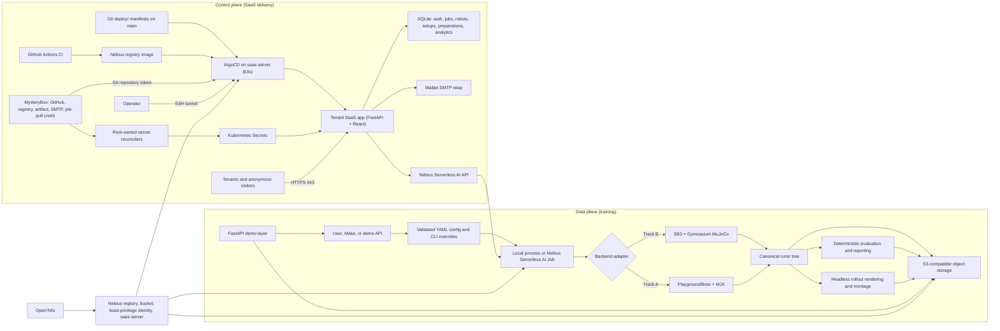

# Sim2Policy architecture

Sim2Policy is a configuration-driven reinforcement-learning template that turns a local or Nebius
Serverless AI training job into durable checkpoints, evaluation metrics, reports, and rollout
media. Track B (Gymnasium MuJoCo + Stable-Baselines3) is the dependable baseline. Track A (MuJoCo
Playground/Brax PPO on MJX) is isolated behind its own dependency and container target so it cannot
break Track B.

Two planes sit on top of the same durable run tree. The **data plane** trains policies as ephemeral
Serverless AI Jobs and writes artifacts to S3. The **control plane** is an always-on `saas-server`
VM running a single-node k3s cluster and ArgoCD, which GitOps-deploys a tenant-facing SaaS app
whose image is built by GitHub Actions and pulled from the Nebius registry. The training path is
unchanged; the control plane is an isolated front door.

This file is the system's source of truth for boundaries, decisions, and their rationale.
`openspec/specs/` states *what each capability must do*; this file states *how the system is put
together and why*.

## Where things are documented

| Document | Scope |
| --- | --- |
| `README.md` | One-page project introduction |
| `ARCHITECTURE.md` (this file) | System boundaries, decisions, and rationale |
| `AGENTS.md` | Working agreements, cloud cost rules, auth setup for tooling |
| `openspec/specs/*/spec.md` | Per-capability behavioural requirements and scenarios |
| `saas/README.md` | Tenant SaaS app: API surface, auth, custom-robot flow, tests |
| `saas/API_RUNBOOK.md` | Production-safe authenticated API operations |
| `saas/ANALYTICS_QUERIES.md` | Read-only SQL cookbook for visit analytics |
| `saas/backend/validation_suite/README.md` | My Robots form-validation matrix runner |
| `saas/samples/robots/README.md` | Canonical primitive-only MJCF samples |
| `sim2policy/README.md` | Training template: tracks, commands, demo API, presets |
| `sim2policy/VERSIONS.md` | Pinned dependency matrix per backend |
| `sim2policy/docs/` | API reference, submission checklist, demo script, release audit |
| `sim2policy/jobs/README.md` | Nebius job submission wrapper and gate order |
| `sim2policy/infra/nebius/README.md` | OpenTofu stack, bootstrap resources, secret rotation |
| `deploy/README.md` | GitOps layout ArgoCD reconciles |
| `IMPLEMENTATION_LOG.MD` | Gitignored operator handoff log (never credentials) |

Historical OpenSpec change proposals, designs, and task lists were consolidated into this file and
the READMEs above; their full text remains in Git history.

## Main boundaries

- `openspec/specs/` is the behavioural source of truth: one directory per capability, each stating
  requirements and the scenarios that verify them.
- `sim2policy/src/sim2policy/` contains shared configuration, run lifecycle, storage, evaluation,
  rendering, telemetry, reporting, API, campaign control, and backend-specific trainer adapters.
- `sim2policy/configs/` holds reproducible environment/run contracts, hosted-demo presets, and the
  showcase campaign matrix.
- `sim2policy/Dockerfile` has backend-isolated `sb3` and `mjx` runtime targets.
- `.github/workflows/training-runtime-images.yml` builds both targets on CPU runners, validates
  backend-specific imports, publishes target-qualified immutable tags (`sb3-<sha>` / `mjx-<sha>`),
  and only then advances the `sb3-runtime` / `mjx-runtime` compatibility tags.
- `sim2policy/jobs/submit.sh` is the validated Nebius job boundary; it constructs argument arrays,
  enforces a timeout, and accepts MysteryBox secret selectors without printing their values.
- `sim2policy/infra/nebius/` uses OpenTofu to provision the container registry, bounded/versioned
  artifact bucket, and least-privilege artifact service account. Serverless jobs remain explicit
  submissions, not persistent infrastructure resources. `saas.tf` adds the always-on `saas-server`
  VM, dedicated orchestration identity, scoped MysteryBox secrets/read permits, and a
  `nebius_vpc_v1_security_group` that admits only 22/443/80;
  `cloud-init/saas-server.yaml.tftpl` bootstraps k3s, ArgoCD, and root-owned Secret reconcilers.
- `saas/` is the tenant-facing SaaS application: a FastAPI backend (`saas/backend/`) exposing the
  authenticated robot/setup/preparation/training APIs and the unauthenticated public showcase, with
  verified-email tenant scoping, SQLite persistence, and pluggable mock or Nebius orchestration,
  plus a React + Vite + TypeScript frontend (`saas/frontend/`). Original primitive MJCF examples
  live under `saas/samples/robots/`. One multi-stage image serves API, samples, and UI.
- `deploy/` holds the GitOps state ArgoCD reconciles: `deploy/argocd/` (app-of-apps `Application`s)
  and `deploy/manifests/` (SaaS Deployment/PVC/Service/Ingress plus cert-manager issuers).
- `.github/workflows/saas-image.yml` builds the SaaS image and pushes it to the Nebius registry,
  authenticating with a `registry.pusher` service-account credential via `docker login --password-stdin`.
  A successful `main` build commits the immutable image tag to that branch's kustomization after
  verifying that the branch has not advanced, so ArgoCD deploys the exact build without an operator
  override.
- `runs/<run-id>/` is canonical while a process runs. `checkpoints/`, `tensorboard/`, `videos/`, and
  `report/` map to the same subpaths at `s3://<bucket>/sim2policy/<run-id>/`, which is canonical
  across ephemeral jobs. A checkpoint is uploaded fully before `latest.json` is advanced.
- `sim2policy/web/` and the `sim2policy.api` package provide the thin data-plane demo surface. Run
  status and artifact manifests live in the same durable run tree, keeping API instances stateless.

# Data plane: the training template

## Backends and tracks

Backend-specific trainers (`train_sb3.py`, `train_mjx.py`) sit behind common run configuration and
artifact conventions. Shared modules own validated configuration, run metadata, object-storage
operations, evaluation/report schemas, and command-line behaviour. A single polymorphic trainer was
rejected because SB3 and Brax/Playground have materially different checkpoint, vectorization,
callback, and inference APIs; separate projects were rejected because shared run identity and
output conventions are the point of the template. Track B ships and is accepted first; Track A is
additive and isolated, so a JAX/CUDA incompatibility cannot make Track B unrunnable.

SB3 hyperparameters are adapted from RL Baselines3 Zoo and recorded in-repo. Playground defaults are
selected explicitly rather than silently following whatever a newly installed package version
provides.

## The run contract

Each environment config declares backend, environment identifier, seed, training budget,
parallelism, checkpoint cadence, evaluation settings, success threshold, and backend-specific
hyperparameters. CLI flags select the config and supply run identity or narrowly scoped overrides.
Startup validation rejects missing, incompatible, or unknown critical settings before an expensive
job is created. Resolved configuration, package versions, source revision, start time, backend,
environment, and device information are written to run metadata; credentials never are.

`status.json` advances through `queued → starting → training → rendering → evaluating →
completed`, or to `failed` from any phase, each update carrying a timestamp and progress summary.
`report/artifacts.json` maps logical names (`final_policy`, `metrics_json`, `report_md`,
`video_untrained`, `video_mid`, `video_final`, `progression_montage`) to object keys.

## Durability and resumption

Every process writes first to `runs/<run_id>/`; `storage.py` maps those paths to
`s3://<bucket>/<prefix>/<run_id>/...` through an endpoint-configurable boto3 client, using the
standard credential provider chain. Local-only mode is supported when storage is not configured.

Explicit S3 synchronization is preferred over a mounted bucket because it is portable across
S3-compatible providers and makes lifecycle and error behaviour testable. Checkpoint publication
uploads the object completely and only then advances the latest-checkpoint record, so resume never
selects a partial object. Periodic sync is driven by trainer callbacks and timers; a best-effort
shutdown handler plus a mandatory normal-completion sync publish the remainder. Transient failures
retry with bounded backoff, retain local files, and record degraded sync status; a run that cannot
make its required final artifacts durable exits non-zero and names them.

Resume is explicit: it discovers the latest completed checkpoint, validates backend, environment,
and configuration compatibility, downloads it, and continues from the recorded progress. An
incompatible checkpoint fails before training rather than silently restarting the counter.

**The destination travels as a unit.** A job's bucket, endpoint, region, *and* `storage.mode` are
set together on every command path — SB3, MJX, and curriculum — and asserted per path rather than
for one representative example. The configs declare `mode: local`, and an `ArtifactStore` is inert
unless the mode is `s3`, so a path that forwards the destination without the mode trains for its
full budget and durably writes nothing. Nothing downstream can detect this except verification,
which sees only an unreadable manifest.

## Rendering, evaluation, reporting

Rendering and evaluation are separate commands that consume a checkpoint plus resolved run
metadata, so a graphics failure cannot invalidate training and media can be produced on a different
machine. Rendering runs deterministic inference with an explicit seed, preserves frames across
episode resets, and encodes MP4 through imageio/ffmpeg. It attempts EGL first and retries once with
OSMesa **in a fresh process**, because MuJoCo's graphics-backend selection is process-global. A
no-checkpoint smoke command renders and validates at least ten frames for container preflight.

Evaluation defaults to 20 deterministic episodes across five seeds, retains per-episode reward and
length, and takes its success criterion from the resolved environment configuration — a mean-reward
threshold for SB3 environments, sustained-velocity and non-fall conditions for MJX locomotion.
`report/metrics.json` carries checkpoint identity, backend, environment, seeds, per-episode
measurements, aggregates, success result, threshold definition, runtime, and device/version
metadata. The Markdown report adds the reward curve and time-to-threshold. Cost is runtime times an
explicit timestamped rate; missing utilization or price inputs are marked unavailable, never
invented. Backend comparisons consume metrics documents rather than parsing console output and
disclose environment, budget, seed, hardware, version, and criterion differences.

For curated runs the progression document records the initial checkpoint, evaluated intermediate
candidates, and the selected checkpoint, each with exact step, digest, seed set, per-episode and
aggregate metrics, criterion, success result, evaluation runtime, and rollout identity. Selection
uses task metrics on a selection seed set disjoint from final acceptance; the final step and the
highest scalar reward confer no preference. When an earlier checkpoint wins, the public final
rollout uses it while the montage retains the final-step rollout labelled as a measured regression.

## Data-plane demo API

`sim2policy.api` is a thin, stateless FastAPI layer over the same pipeline: `GET /health`,
`GET /training-options`, `POST /train`, `GET /runs/{run_id}`, `GET /runs/{run_id}/artifacts`. It
never trains; it validates against the preset allowlist, generates a safe `run_id`
(`<preset>-<UTC-timestamp>-<random-suffix>`), persists `metadata/request.json` and an initial
`status.json`, and triggers an orchestration backend. All status and artifact responses are read
back from object storage, so instances hold no run state and a real Nebius job and a mock run are
observed identically. Artifact URLs are presigned and scoped to the run prefix; none is built from
client input. A configurable demo token gates the mutating endpoints while `/health` stays open.

`configs/training_presets.yaml` *is* the allowlist. Each preset pins backend, environment,
algorithm, base run-config file, and hard step/duration limits, and declares the small set of safe
overridable parameters with bounds. A config file was chosen over hardcoded Python presets so the
allowlist stays auditable and feature-flaggable. `halfcheetah-demo`, `ant-demo`, and `ant-quality`
are enabled; `go1-mjx-demo` is present but disabled, hidden from `/training-options` and rejected by
`POST /train` while its flag is off.

Orchestration is behind an interface with `nebius` and `mock` implementations, selected by
configuration. The Nebius backend shells out to `jobs/submit.sh` — reusing one audited submission
path and its secret handling rather than duplicating job assembly. This data-plane API is distinct
from the tenant SaaS app, which has its own SDK-based orchestration path.

## Runtime images

`sim2policy/Dockerfile` provides `sb3` and `mjx` targets over a shared base, each with tested
dependency pins, MuJoCo headless libraries, ffmpeg, unbuffered logs, and no embedded credentials.
CI matrixes over the two targets in one workflow rather than duplicating the disk-free, buildx,
login, and tag/push logic in two files; each leg keeps its own BuildKit cache scope.

Immutable tags are target-qualified — `sim2policy:sb3-<sha>` and `sim2policy:mjx-<sha>` — because a
bare `sim2policy:<sha>` cannot distinguish two runtimes built from one commit. The immutable tag is
pushed and reported first; only then does the moving `sb3-runtime` / `mjx-runtime` compatibility tag
advance to the same image content. Untrusted pull-request contexts receive no registry credentials.
Concurrency cancellation drops superseded revisions, and manual dispatch exists for recovery after a
credential or registry outage.

Container images are built in GitHub Actions and consumed by separate ephemeral AI Jobs, keeping
Docker compilation and registry upload off costly accelerator time and off any long-lived VM.

# Control plane: the SaaS front door

## Infrastructure

A single `saas-server` CPU VM (`cpu-e2` / `2vcpu-8gb` by default, `ubuntu24.04-driverless`, static
public IP, dedicated service account) self-bootstraps a one-node **k3s** cluster and **ArgoCD**
through cloud-init. k3s on one cheap VM was chosen over Nebius Managed Kubernetes (more moving parts
and cost for a single-node need), over `docker compose` + systemd (no GitOps story, which was an
explicit requirement), and over Serverless Containers (a poor fit for hosting a stateful control
loop). Bootstrap is idempotent: the k3s installer is re-run-safe and everything else is declarative
`kubectl apply`.

Network posture is deliberately narrow. The Nebius security group admits only inbound **SSH (22)**,
**HTTPS (443)**, and **HTTP (80)** for ACME/redirect; a host `ufw` firewall is defense-in-depth. The
k3s API (6443) and the ArgoCD UI are **not** public — operators manage the cluster over an **SSH
tunnel** (`ssh -L`). Exposing ArgoCD behind auth on 443 was rejected as a second public endpoint to
harden; a VPN or bastion is heavier than one operator needs.

## GitOps delivery

**Git is the source of truth.** ArgoCD syncs `deploy/` from `main` with automated sync, prune, and
self-heal, so a merge is the only action needed to change what runs, and a manual cluster edit is
reported OutOfSync and reverted. The SaaS app image is built by GitHub Actions, pushed with an
immutable commit tag, committed back to the GitOps kustomization by the workflow (guarded by a
stale-ref check and marked `[skip ci]` to avoid recursion), and pulled from the Nebius registry.
Tag and manual-dispatch builds publish images without touching production GitOps state.

ArgoCD reads the private manifests repo using a **GitHub token sourced from MysteryBox** at boot.
Image pull uses a Kubernetes `imagePullSecret` rather than node identity: a real k3s test showed
containerd cannot exchange the VM identity directly with the Nebius registry, and IAM v2 access
keys are S3-style credentials that do not authenticate to the registry. A `CONTAINER_REGISTRY`
static-token secret with username `iam` is therefore required.

Deployment shape follows from SQLite on a ReadWriteOnce PVC: `replicas: 1` and strategy `Recreate`,
so the old pod releases the volume before the replacement schedules. A rolling update would deadlock
on the volume attach. Seconds of rollout downtime is the accepted price.

## Domain and TLS

The site is served at `https://sim-policy-trainer-challenge.info` through k3s's bundled Traefik with
a Let's Encrypt certificate. cert-manager is installed as an ArgoCD child Application from the
Jetstack Helm chart pinned at `v1.21.0` — the upstream supported install path, pinned by
`targetRevision`, without vendoring ~30k lines of generated YAML. A `letsencrypt-prod` ClusterIssuer
(ACME HTTP-01 through Traefik, registration email `andygolubevremit@gmail.com`) plus a
`letsencrypt-staging` issuer for troubleshooting live in `deploy/manifests/cert-manager/` and sync
through a sibling child Application.

HTTP-01 was chosen over DNS-01 because port 80 is already open, the registrar has no API integration
here, and only a single non-wildcard host is needed. A ClusterIssuer avoids per-namespace
duplication since the certificate lives in `saas` while cert-manager runs in `cert-manager`. TLS is
declared on the existing Ingress via the `cert-manager.io/cluster-issuer` annotation, so the
certificate's lifecycle is tied to the ingress that uses it. The 80→443 redirect is per-router — a
namespace-scoped Traefik `redirectScheme` middleware on the SaaS ingress — because cert-manager's
solver ingress is a separate, more specific router without the middleware, so ACME challenges are
never redirected. A fresh VM converges with no imperative `kubectl` or `helm` step; reverting the
commit prunes cert-manager and the TLS configuration.

## Secrets in use

All credentials originate in versioned **MysteryBox** payloads and reach workloads either as
Kubernetes Secrets reconciled by root-owned units (using the VM identity) or as secret references
resolved by Nebius services at use time. Values never appear in Git, OpenTofu inputs, command
arguments, or logs; OpenTofu records only non-secret secret/version IDs.

| MysteryBox secret | Payload keys | Consumed by |
| --- | --- | --- |
| `sim2policy-saas-github-token` | GitHub token | ArgoCD repo access, fetched once at boot by cloud-init |
| `sim2policy-saas-registry-pull` | `token` | k3s `nebius-registry` dockerconfigjson imagePullSecret (username `iam`) for pulling the SaaS app image |
| artifact access-key secret (created by `nebius_iam_v2_access_key.artifacts`) | `secret` (paired with the non-secret `artifact_access_key_id`) | `saas-nebius` Kubernetes Secret (`AWS_SECRET_ACCESS_KEY` for the backend's S3 artifact reads) and injected into each training job as a MysteryBox env-secret |
| `sim2policy-saas-smtp` | seven `SAAS_SMTP_*` keys | `saas-smtp` Kubernetes Secret for Mailjet login-code delivery |
| `sim2policy-job-registry-creds` | `REGISTRY_USERNAME`, `REGISTRY_PASSWORD` | Serverless AI jobs API at image-pull time, referenced by version ID in each job's `registry_credentials` (the jobs API requires this exact key shape; the single-key `token` pull secret is not accepted there) |

Kubernetes Secrets on the cluster: `saas-nebius` (the orchestration env contract — `NEBIUS_*`,
`AWS_*`, `SIM2POLICY_*`, `CUSTOM_ROBOT_*`, `SAAS_ANALYTICS_IP_SALT`, including selector/version
references, reconciled by `saas-nebius-sync.service`), `saas-smtp` (reconciled from one pinned
version by `saas-smtp-sync.service`), and the `nebius-registry` imagePullSecret. The orchestrator
itself holds no long-lived key: the Nebius SDK authenticates with the **VM-managed renewable IAM
token** mounted read-only into the pod. The pod mounts the metadata *directory*, not the token file,
because Nebius rotates the `..data` symlink target atomically and a file-level bind would pin a
stale inode. Payload-viewer permits are scoped per secret to the `saas-server-access` group;
rotation means adding a new MysteryBox version, updating only the pinned version ID, and rerunning
the corresponding sync unit.

Reconciliation is a root-owned, idempotent systemd unit that obtains a short-lived token from
instance metadata, fetches the selected MysteryBox versions, writes temporary material only to a
mode-`0600` root-owned file, applies the Secret through
`kubectl create secret … --dry-run=client -o yaml | kubectl apply -f -`, and traps cleanup. It fails
closed without echoing response bodies. A purely documented operator command was retained only as a
break-glass path because it cannot meet the shell-history requirement as reliably.

The dedicated `sim2policy-saas-orchestrator` service account is attached to the VM and is the only
identity with a project-level grant for Serverless AI job creation and cancellation. It is
deliberately separate from `sim2policy-saas-ci` (registry pusher) and `sim2policy-artifacts` (S3).
Cluster verification found that jobs created by that account stayed in `PROVISIONING` under the
documented `editor` prerequisite regardless of authentication method or client, while a
project-scoped `admin` grant let the same metadata-token job reach `STARTING` in about a minute.
The grant is therefore `admin`, isolated to that one non-interactive account, documented as
temporary, and to be narrowed as soon as Nebius exposes a job-scoped role. Human credentials,
tenant-wide admin membership, and long-lived service-account keys remain prohibited.

## Email authentication and delivery

Authentication is passwordless: the browser calls `POST /auth/request-code`; only the backend
generates the six-digit code. The backend stores a hash with a ten-minute expiry, then sends the
plaintext code through authenticated Mailjet SMTP over STARTTLS. Codes are single-use and die after
five wrong attempts; the response is identical whether or not the email has an account. Sessions are
opaque server-side bearer tokens (not JWTs) with a 24-hour default TTL, because instant revocation
matters more than statelessness at this scale and there is no key material to manage. Auth is a
FastAPI dependency rather than middleware, so per-route opt-in stays explicit and testable. The
tenant identity for every authenticated route is the session's verified email; the old
`X-Tenant-Id` header is not accepted.

The production Deployment explicitly selects `smtp` and requires the non-optional `saas-smtp`
Kubernetes Secret, reconciled from one pinned MysteryBox version containing exactly seven
allowlisted `SAAS_SMTP_*` keys. Making the reference non-optional prevents a rollout from silently
falling back. Local and test processes may select `mock`, but the production manifest and a CI
assertion reject mock delivery. `saas-nebius` was not reused because email credentials have a
separate owner, rotation schedule, and failure domain.

Provider acceptance is part of request success. Connection, timeout, TLS, authentication, recipient,
quota, or provider rejection failures delete the unusable pending code and return a sanitized
retryable `503` with `Retry-After`; abuse rate limiting still counts the request, so an outage
cannot become an unbounded delivery-attempt path. Writing the code before sending and deleting on
failure was chosen over sending first, which leaves a race where a fast recipient submits a code
that does not exist yet. Real-delivery logs contain only result category and latency, never the
recipient, code, SMTP response, API Key, or Secret Key. The sender domain is authenticated with SPF,
DKIM, and DMARC; inbox placement remains the responsibility of Mailjet and recipient mail systems,
so a `200` means provider acceptance, not delivery.

## Persistence

Users, sessions, jobs, artifact manifests, immutable robot XML and metadata, normalized setup
drafts, preparation attempts, training provenance, and visit analytics live in SQLite at
`SAAS_DB_PATH` — `/data/saas.db` on the single-writer `saas-data` PVC in the cluster, a local file
by default so development and tests need no volume. Schema is created at startup with
`CREATE TABLE IF NOT EXISTS` plus additive migration; every existing row survives.

Raw `sqlite3` behind the existing store interfaces was chosen over Postgres (an operator, manifests,
credentials, and connection handling the single-replica PoC does not need) and over SQLAlchemy (a
dependency for a handful of small tables when the store interfaces are already the portability
seam). One database file in WAL mode with `synchronous=NORMAL`, one connection per store guarded by
the existing `threading.Lock`, avoids a connection-pool abstraction.

Pending one-time codes and rate-limit windows stay in process memory deliberately: they live ten and
fifteen minutes respectively, losing them is harmless, and keeping them off disk avoids writing
security-sensitive hashes. Everything whose loss actually hurts — sessions, users, job history — is
durable, so a valid token survives restart.

Quotas are enforced before a row is written: at most 20 active robot versions and 50 active setup
drafts per tenant, plus the 1 MiB per-robot upload limit. Preparation uniqueness (at most one
non-terminal attempt per setup/fingerprint) and concurrency/idempotency reservations are
transactional, taken *before* the orchestrator creates a remote resource.

Every table other than analytics is retained indefinitely; there is no delete path for tenant, job,
artifact, or robot state. The PVC is node-local and single-writer, matching the one-replica
deployment; it improves rollout and restart durability but is not a cross-node database or an
independent backup. Rebuilding the VM therefore also requires a planned SQLite backup/restore or
migration if that state must survive loss of the node or disk. Git remains canonical for manifests
and immutable image selection, MysteryBox for credentials, and S3 for training artifacts.

## Nebius orchestration

The SaaS app talks to Serverless AI jobs through the official Nebius Python SDK
(`JobServiceClient`), not by shelling out to the CLI: shipping the CLI in the image, parsing stdout,
and shell-quoting job args is fragile and harder to test. `jobs/submit.sh` remains the behavioural
reference for the job spec. The `mock` backend remains available and remains the default, so the
full lifecycle is exercisable with no Nebius credentials or GPU, and switching backends changes no
request or response shape.

Submissions are built exclusively from typed, server-owned specifications. There is no generic
pass-through job-spec path and no public submission path: the only validators that exist are custom
preparation and custom training, and the call graph from any showcase route reaches no
launch or submit function. Every field — image, command/mode, configuration, platform, preset,
timeout, disk, input/output prefixes, bounds, secret selectors — comes from the typed specification.
Settings are validated at startup so a misconfigured pod fails its readiness probe instead of
failing on the first tenant request; the old ReplicaSet keeps serving.

Reconciliation is durable rather than fire-and-forget. The returned `aijob-*` identity is persisted
before the job is reported running. Remote success moves the tenant job into **finalization**, not
`completed`: the backend checks canonical S3 status and the required artifact manifest, validates
every referenced path under the run prefix, and only then writes `completed`. Treating a 409 as an
unbounded post-completion settling period was rejected because it produces a false completed state
and a permanent UI skeleton. At startup the single replica scans persisted non-terminal jobs and
resumes reconciliation from their stored remote identities, idempotently and without resubmitting.
Deadline expiry or terminal validation error writes `failed` with a phase and sanitized summary,
retaining the remote identity and last successful phase for operator diagnosis.

## Artifact access

The backend reads status, metrics, manifests, and media metadata from the artifact bucket over the
S3 API, scoped to `sim2policy/<run-id>/`. Submitted jobs receive the same artifact credentials, with
the access key as a plain env var and the secret key as a MysteryBox secret reference, so the
training container writes to the same prefix without the secret transiting the job spec.

The cached manifest maps **opaque artifact identifiers** to validated server-side keys. Tenant
responses carry an application access URL, never a bucket key. On access the backend verifies the
bearer session, job ownership, and manifest membership, then streams with byte-range support or
redirects to a short-lived presigned HTTPS URL — the redirect preserves efficient S3 range playback
without proxying large videos through a 512 MiB pod. The bucket stays private. Cross-tenant
identifiers return 404 without revealing existence, and a caller-supplied key triggers no S3 read.

A manifest published *after* a job completed is recovered lazily: on a cache miss for a completed
job the backend reads `report/artifacts.json` once, validates, caches it durably, and returns.
A transient S3 error degrades to the structured not-ready response rather than a 5xx. A background
retry loop was rejected — it adds lifetime and threading complexity and does not help jobs that
completed before a restart.

The public showcase surface and the tenant surface are **distinct code paths with distinct identity
resolution**. The public path never consults session state to widen access; the tenant path never
accepts a showcase example ID as authority to read a job. Pinned showcase run identities are
validated at startup to be distinct from the tenant job identity space (`uuid4().hex`, 32 lowercase
hex characters), and a colliding or unsafe value simply leaves that entry unpublished.

# Product surfaces

## Public showcase

The unauthenticated landing view is a read-only evidence gallery of seven server-owned examples, in
this order: `g1-rough-terrain`, `go1-walker`, `ant-explorer`, `halfcheetah-sprint`,
`hopper-balance`, `walker2d-stride`, `reacher-target`. Each entry binds one stable example ID to
exactly one curated run identity declared in `catalog.SHOWCASE_RUNS` — reviewable source, not
configuration, because the resolver's only input is an example ID and its only output is a literal
from that map. A client cannot supply, override, enumerate, or influence which run an example
resolves to.

`GET /showcase`, `GET /showcase/{example_id}`, and
`GET /showcase/{example_id}/artifacts/{artifact_id}` require no session, cookie, or token, and
ignore one if presented. Responses are served from durably cached validated manifests rather than a
per-request storage crawl, per-client rates are bounded (429 beyond the budget), and a storage
failure degrades to a sanitized unavailable state or an unpublished entry — never a 5xx on the
landing page. Responses contain no tenant email, job ID, bucket name, object key, credential,
secret selector, or unallowlisted resolved-configuration field.

Publication is evidence-gated. An entry appears only when its pinned run's manifest is readable and
valid, every required artifact exists in-prefix with safe identity and integrity metadata, the
recorded canonical environment and backend match the server-owned declaration
(`curation.CANONICAL_ENVIRONMENTS` / `CANONICAL_BACKENDS`), and its evaluation records task success
as true. Entries display the sanitized configuration, hardware, rate, and runtime the pinned run
actually recorded — never current catalog defaults — and are withheld when the declaration and the
run disagree. Each card uses an original, repository-owned, same-origin SVG avatar with no
third-party image request; the avatar is decorative and the containing control carries the
accessible label and task.

Exactly one operator-reviewed exception exists, as an exact tuple in `curation.VERIFIED_RECORDINGS`:
example `g1-rough-terrain`, run `showcase-gallery-g1-20260801-16-g1-s0-rough`, environment
`G1JoystickRoughTerrain`, backend `mjx`. It passes every other evidence gate and is published as a
verified *recording* with `evaluation.success: false` and its actual 0/20 horizon result, never as
an accepted locomotion result. A near-match on any field falls back to the ordinary accepted-only
rule. The public gallery and detail deliberately render no met/below-threshold badge and no derived
KPI grid — the compact measured facts and structured evidence remain — while the authenticated
owner job result keeps its KPI summary.

Backend is server-owned display metadata: each entry reports the one SB3 or MJX runtime its pinned
run used, with no backend, algorithm, or compute selector anywhere in the UI. Offering both backends
per card would double the acceptance matrix — each dual-backend entry needs equivalent
observation/action/reward/termination semantics, a second runtime and job spec, backend-specific
checkpoints and rendering, comparable evaluation, measured guidance, and independent cloud
acceptance — without giving most users a clearer task choice.

**Nothing in the showcase can start training.** No showcase route creates, queues, mutates, or
schedules a job record, remote resource, preparation, or storage write under any parameter, method,
or header, and no showcase response advertises a training action. `POST /jobs` is retained solely to
answer old clients honestly: it returns **410 Gone** pointing at
`POST /robot-setups/{setup_id}/training-jobs`. The only path that creates a training job is an owner
starting their own accepted custom robot setup. `GET /training-options` survives as showcase display
metadata for existing clients and declares no submittable environment, algorithm, preset, profile,
or parameter contract.

## Bring Your Robot

The robot-onboarding path is deliberately inside the SaaS control plane and outside the training
data plane.

**Upload.** `POST /robots` takes multipart `name`, `robot_type` (`quadruped` or `biped`), and one
`.xml` file. At most 1 MiB of UTF-8 XML, primitive geometry only, exactly one floating root, at
least one controllable hinge joint, unique names, actuators referencing existing joints, and limits
of 64 bodies, 64 joints, 64 actuators, 128 geoms, and XML depth 16. DTD and entity declarations are
rejected before parsing; archives, includes, plugins, meshes, textures, height fields, external
references, file paths, URLs, and unknown or executable elements are rejected before persistence.
Errors are field-oriented and never echo raw XML.

A single self-contained XML was chosen over ZIP or mesh support because it has no archive traversal,
missing sidecar, mesh parser, licensing, or external-path ambiguity — and over "anything MuJoCo can
parse" because compilation alone does not enforce the product's portability and security boundary.
An accepted upload receives a SHA-256 digest and an immutable version; re-uploading identical
content for the same tenant and declared type returns the existing active version. Deletion is soft,
and all reads derive ownership from the bearer session with cross-tenant identifiers returning 404.
The original quadruped and biped samples in `saas/samples/robots/` are packaged into the image and
pass the same public validator with no sample-only exception.

**Compose.** A robot model supplies morphology, not a complete RL contract, so the builder combines
one owned validated robot with a server-owned task (`stand-balance`, `walk-forward`, or
quadruped-only `recover-from-fall`) and a server-owned scene preset (`flat-arena`, `ramp-course`,
`hurdle-course`, or `step-course`). Optional scene edits are restricted to at most six *total*
bounded `box`, `ramp`, `hurdle`, and `step` objects — including the preset's own composition —
inside the published ±10 m arena bounds, with server-declared defaults and numeric bounds per
parameter. There is no object file, mesh, scene package, URL, reward, environment code, container,
or plugin upload surface: even a simple mesh would introduce format parsing, units, collision
geometry, complexity, licensing, and storage questions the product does not need. A tenant may keep
50 active immutable normalized setup drafts, each persisted as canonical JSON with a content digest.

**Prepare.** A saved setup's derived `training_readiness` moves through `not_prepared`, `preparing`,
`ready`, or `preparation_failed`; a setup whose robot type, task/robot compatibility, or scene falls
outside the server contract is `ineligible` with a stable reason. Every catalog-valid setup is
admissible — both robot families, all three tasks within their compatibility rule, all four scenes,
and any bounded object combination within the six-object total.

Preparation is a bounded asynchronous `cpu-d3` job on the immutable generic SB3 runtime. It verifies
the input manifest and exact S3 input digests, reapplies the stricter training allowlist, composes
the server-owned world, compiles with the pinned MuJoCo version, validates finite compiled dynamics
and bounded dimension/control spaces, runs deterministic resets and bounded zero/random-action
rollouts, renders and probes a headless frame, checks the Gymnasium/SB3 environment contract, and
completes a short PPO learn/save/reload/deterministic-evaluation cycle. Acceptance requires every
mandatory phase plus a readable checksummed report, and is fingerprinted to the robot digest,
normalized-setup digest, immutable runtime image digest, adapter/reward schema versions, and
preparation-profile version. Any material fingerprint change requires a new preparation.
Preparation means execution compatibility, not guaranteed task convergence.

Inputs are server-selected: `robot.xml`, `normalized-setup.json`, and `input-manifest.json` are
written beneath `sim2policy/preparations/<preparation-id>/inputs/` with server-derived names and
matching digests. No tenant request selects an object key, URL, image, command, environment
variable, secret, platform, preset, or entrypoint, and no per-robot image is ever built — every
attempt references the same configured immutable runtime digest. Public responses and logs expose
only allowlisted phase codes and sanitized bounded diagnostics: never XML content, credentials,
secret selectors, tenant identifiers, absolute paths, bucket keys, raw provider responses, or stack
traces. Active attempts resume reconciliation after a SaaS restart without creating a second job; a
failed attempt may be retried as a new attempt for the same fingerprint, and the failed one is
preserved for diagnosis.

**Train.** Only the latest accepted current fingerprint enables the setup-bound Start training
action, `POST /robot-setups/{setup_id}/training-jobs`, which accepts the setup identity plus
idempotency metadata and nothing else. It creates a normal `job_kind=custom-robot` Job using the
immutable generic SB3 image and the fixed `custom-ppo-quick` `cpu-d3` profile. The tenant cannot
select an image, command, object key, hardware, secret, code, reward, or hyperparameter; uploaded
MJCF is inert runtime input. Before remote training starts, the accepted robot XML, normalized
setup, and input manifest are content-addressed beneath the server-generated run prefix and their
digests are verified against the accepted fingerprint; a mismatch refuses creation and asks the user
to prepare the current setup. Soft-deleting the source robot or setup blocks new starts while
retained preparation and job history and owned artifacts stay readable and reproducible from the
snapshot.

Results use the normal artifact lifecycle and add the exact XML and setup, resolved
schemas/configuration, evaluation, rollout MP4, checkpoint, and a checksummed simulator-only policy
bundle. A run becomes `completed` only when a load-tested final checkpoint, deterministic multi-seed
task evaluation, per-episode and aggregate metrics, human summary and reward curve, final rollout
MP4, resolved configuration and runtime metadata, validated manifest, and policy bundle are all
readable and valid. Missing the task success threshold is reported honestly as `success=false` on a
completed job, not mislabelled as an infrastructure failure. Custom resources never enter the public
showcase.

### Generic runtime contract

One server-owned SB3/MuJoCo runtime composes any accepted robot into a fixed scene and task
contract, so custom training needs no per-robot image, tenant world code, or tenant-selected
hyperparameters. The runtime owns gravity, timestep bounds, floor and obstacle geometry, contact
defaults, lights, cameras, reset distribution, episode horizon, reward, termination, and evaluation
rules. Tenant world floors, cameras, lights, sensors-as-policy-inputs, external assets, and
unsupported compiled features cannot affect the executable environment: preparation either rejects
them as training-ineligible or deterministically excludes them per the published adapter schema,
rather than silently changing the task.

For each accepted robot the runtime derives a deterministic ordered observation schema — versioned
root pose/orientation, root linear/angular velocity, normalized actuated-joint position/velocity,
previous action, task target — and an action schema of one normalized continuous value per eligible
motor actuator, clipped to `[-1, 1]` and mapped to verified finite control ranges. Identical
fingerprints in the same runtime digest produce identical dimensions, ordering, normalization,
bounds, and schema hashes. Robots with different actuator counts get different action dimensions
from the same image and the same fixed profile schema. Every numeric observation, reward, action,
and state bound is checked for finiteness.

Versioned contract identifiers travel with every fingerprint and are mirrored between
`saas/backend/app/custom_training.py` and `sim2policy.custom_robot_contract`, with a cross-package
golden test preventing drift: schema version 2, adapter `custom-robot-sb3-v2`, rewards
`locomotion-rewards-v18`, scenes `custom-locomotion-scenes-v3`, preparation profile
`custom-prepare-v1`, training profile `custom-ppo-quick-v3`.

### Frozen profiles

The preparation profile is `cpu-d3` / `4vcpu-16gb`, 50 GiB, with a ten-minute overall cap and
per-phase deadlines (manifest 30 s, compile 45 s, rollout 120 s, checker 60 s, render 60 s,
learning 240 s, publish 30 s). The eight canonical combinations measured about 3m42s–3m57s
create-to-finish.

`custom-ppo-quick` at contract version `custom-ppo-quick-v3` is `cpu-d3` / `16vcpu-64gb`, 100 GiB,
sixteen subprocess vector environments, 3M timesteps, and a three-hour cap, with observation and
reward normalisation and best-checkpoint publication. The v1 shape — eight serial environments and
100k steps, roughly twelve PPO updates — finished in minutes but reliably produced 100% fall rates
even for the bundled sample robots on flat ground, and measured runs regressed after 25k steps. v2
keeps the same fixed server-owned shape but spends real compute so the attempt can actually
converge. It is still not a promise that a given robot reaches its threshold; evaluation reports the
outcome honestly either way.

## Policy bundles

Finalization produces one deterministic `policy-bundle.zip` per completed custom job and per curated
showcase run, containing `README.md`, `manifest.json`, `resolved-config.json`,
`evaluation/metrics.json`, `runtime/versions.json`, and the final backend-native checkpoint beneath
`checkpoint/`. A custom bundle additionally carries the exact validated `robot.xml`, canonical
`normalized-setup.json`, resolved task/scene/adapter/reward/profile configuration, and ordered
observation/action schemas with their normalization.

Member paths, order, timestamps, and JSON serialization are normalized so identical finalized inputs
produce an identical SHA-256 digest. The archive contains only fixed safe relative paths and no
credentials, tenant identifiers, absolute paths, storage keys, logs, arbitrary extras, external
references, or rollout video — the final rollout stays a separate streamable artifact rather than
inflating the archive. The checkpoint is preserved in its native format with the matching loader
named in the manifest, rather than converted to a lossy or unverified "universal" format.

Before a bundle is exposed, the backend validates the outer digest, the bounded safe member list,
the required envelope files, the internal manifest schema, and every declared member digest; for
custom runs, finalization additionally extracts it in a bounded temporary location, reconstructs the
generic environment in the same immutable runtime, loads the checkpoint into the recorded
observation/action schemas, and completes a bounded deterministic inference smoke test. A dimension
mismatch or an unsafe member fails finalization rather than publishing a broken download.

Download is optional and never required to understand a result: the browser view answers what
trained, whether it met its criterion, how long it ran, what it cost, and which checkpoint and
runtime produced the rollout. The owner downloads through the tenant-authorized artifact route; an
anonymous visitor downloads a published showcase bundle through the pinned-run-allowlisted public
route. Both surfaces state, before download and inside the archive, that the policy targets the
pinned simulator contract and is **not** directly deployable to a physical robot — real deployment
needs independent control-rate, sensor/actuator mapping, safety, calibration, latency, and
dynamics-transfer work. A policy that meets its simulation threshold is never described as
production-ready or hardware-safe.

## Web UI

One consistent **light** visual system spans public and authenticated surfaces: a white/blue/green/
teal token palette, Archivo with declared system fallbacks, a consistent type and spacing scale,
square structural rules, WCAG AA contrast, a visible teal `:focus-visible` treatment,
keyboard-operable controls, and layouts usable from 375 px through desktop. The app deliberately
does **not** substitute a dark token set for `prefers-color-scheme: dark` — every text, control,
alert, and focus state stays readable in the selected palette. Loading, error, empty, hover,
pressed, and selected states are designed and remain distinguishable without relying on motion,
shadow, or colour alone. Vanilla CSS design tokens were chosen over Tailwind or a component library
to keep the build dependency-free and the image small for a handful of screens.

The shared shell provides a sticky top bar and footer with session-aware controls, plus public
client-side **About me** and **Terms of use** views that fetch nothing and require no session;
external links open with `rel="noreferrer"`.

The showcase is the application-root view for a visitor with no session — no redirect to login, no
login flash. Login is reachable but never forced, and a 401 anywhere in the authenticated app clears
the session and returns the user to the public showcase rather than stranding them.

The jobs dashboard shows live lifecycle, artifact readiness, relative timestamps, and stale-state
indications. Finalizing jobs display their current phase instead of an indefinite skeleton; a failed
job shows sanitized failure phase, reason, last update, and retry guidance. Nested metrics render as
summaries and expandable structured values rather than `[object Object]`. The empty state guides the
tenant to My Robots, because uploading and preparing a robot is the only way to create a job. Jobs
and result views use the persisted gallery example identity, label, and avatar when present, so
historical gallery jobs stay fully readable — with no broken re-run affordance — while jobs without
one fall back to their resolved environment/profile or custom robot/task identity.

My Robots distinguishes `Model validated` and `Setup validated` from training readiness and never
shows a control implying a hidden "GPU validation" stage. An eligible saved setup offers **Prepare
for training**; only its latest current accepted fingerprint enables **Start training**, shown with
its fixed `custom-ppo-quick` / `cpu-d3` context. Preparation failure shows a sanitized phase and
reason with a Retry action. A **See a verified example** link opens the read-only showcase as
reference evidence — never as an alternative training action. Starting an accepted setup submits
only the setup identity plus idempotency metadata; the UI disables duplicate submission and the
server idempotency contract prevents duplicate jobs. A setup with a completed job links to that
result and requires an explicit re-run confirmation before another paid run.

The results view embeds manifest-declared MP4s in an accessible HTML5 player, designates the final
rollout as primary media, allows selection among progression and intermediate videos by
human-readable label, supports seeking without loading the whole file, and offers the policy-bundle
action with its simulator-only disclosure. Expired or missing artifact access shows a human-readable
unavailable state with a retry that fetches fresh artifact metadata. The compact result overview
puts identity, evaluation state, primary KPI, runtime, cost, rollout, checkpoint identity, and the
bundle action above resolved configuration, versions, raw metrics, and device data, which live in
labelled sections or collapsed details rather than equal-width raw JSON columns.

## Visit analytics

The SPA keeps all routing in React state and never changes the browser URL, so a whole session
produces one HTML request and server logs cannot attribute page views. Analytics therefore splits
responsibility: the client beacon posts `{visit_id?, view, entity_id?}` to `POST /analytics/collect`
and the backend derives address, user agent, and referrer from request headers, never trusting the
client for anything it could lie about in a way that corrupts the data.

The visit id is a client-minted UUID in `sessionStorage` — per-tab, cleared when the tab closes, so
it is not a persistent identifier and triggers no consent banner. Because it is untrusted by
construction, the server clamps it: it must match a UUID pattern, and a visit is extended only when
the incoming address hash and user agent also match the stored row, so a forged id starts a fresh
visit instead of corrupting one. Thirty minutes of inactivity ends a visit.

The client address is the leftmost `X-Forwarded-For` entry when present (the pod sits behind
Traefik, so the peer address is a cluster IP), falling back to the direct peer, and is stored only as
`sha256(salt || address)` from `SAAS_ANALYTICS_IP_SALT`. The raw address is never written to the
database, to logs, or to any response. **Without a configured salt, recording is disabled
entirely** — an unsalted hash of an IPv4 address is trivially reversible across the 4-billion-address
space, so failing closed is the only honest option. Rotating the salt breaks visitor correlation
across the rotation; the daily rollups already carry the historical uniques.

Three typed tables — `analytics_visits`, `analytics_page_views`, `analytics_daily` — deviate from the
JSON-blob pattern the other stores use, because analytics is aggregated with `GROUP BY` and `COUNT`
rather than round-tripped by primary key. There is **no tenant column**: the moment a tenant id sits
next to an address hash the table stops being anonymous analytics and becomes a per-user activity
log. Fields are bounded at write time (user agent and referrer 512 characters, entity id 128, view
name validated against the known route set) so a hostile client cannot fill the volume.

Crawler user agents are classified at write time and the flag is stored — bot traffic is flagged,
not discarded, so crawler volume stays measurable and separable. An absent user agent is treated as
a bot.

Retention is 90 days of raw rows. A background task on the startup hook rolls each completed day
into `analytics_daily` with `INSERT OR REPLACE` (idempotent), deletes older rows in bounded `LIMIT`
batches so the single SQLite write lock is never held long enough to stall live requests, then
sleeps 24 hours. Running on startup as well means a pod restarting more often than daily still
prunes. Daily totals are about 40 bytes per day and are retained forever; pruning touches only
analytics tables.

The whole write path swallows every exception — storage, validation, missing salt — logs it, and
answers `204` with an empty body. That is the load-bearing property: analytics is bolted onto a
working product and must not be able to take it down. An empty `204` also enforces write-only-ness
structurally, since there is no response shape for data to leak through. The frontend beacon uses
`keepalive: true` and an empty `.catch()`, and its failure changes nothing the user sees.

There is deliberately no read API, dashboard, or admin UI — there is no admin role in this system,
and adding one for a popularity counter is not worth the surface. Statistics are read as SQL over
SSH against the live database; `saas/ANALYTICS_QUERIES.md` is the cookbook.

# Curated showcase campaigns

The public gallery is served from curated runs, and a campaign is what produces one. The controller
(`sim2policy/src/sim2policy/showcase_campaign.py`) owns plan, submit, watch, verify, select, extend,
accept, cleanup, and audit; the operator invokes documented commands and never infers a decision
from live logs. Exit codes are stable: 0 completed the requested transition, 10 remote work is still
active, 20 deterministic rejection, 30 a human decision is required, 40 an invariant or cleanup
failure. Exit 30 and 40 are full stops.

**The matrix is the contract.** `configs/showcase_training_matrix.yaml` declares seeds, step
budgets, checkpoint cadence, hardware, disk, timeouts, ranking rules, hard acceptance floors,
preferred quality targets, and at most one extension per example. Its normalized digest is recorded
in every plan and re-checked at verification, so an experiment cannot drift mid-campaign. Changing
the matrix means a new campaign, not an edited one. Runtime overrides cannot weaken a declared
field; an undeclared value fails preflight before infrastructure resolution.

**Per-attempt state** is `PLANNED`, `PREFLIGHTED`, `SUBMITTED`, `RUNNING`, `FINALIZING`, `VERIFIED`,
`ACCEPTED`, `REJECTED`, `NEEDS_HUMAN`, `CLEANED`, persisted under a gitignored
`.showcase-campaigns/<campaign-id>/` with atomic writes, an append-only journal, and an exclusive
lock that fails rather than queues. Every transition is idempotent: rerunning a completed command
reports the recorded result without resubmitting, retraining, or advancing a different attempt.
`NEEDS_HUMAN` is a stop, not a grave: it may reach `VERIFIED` again, but only through a fresh
verification proving complete durable evidence against a terminal-completed provider state.

**Execution location is part of the evidence.** Every preparation and workload process — dependency
installation, lint/type/unit/integration tests, frontend production builds, Docker/BuildKit work,
container health and import checks, environment construction, smoke runs, campaign transitions,
artifact verification, checkpoint selection and evaluation, rendering, training, finalization — runs
on Nebius compute and carries a sanitized location attestation naming instance or job identity,
region, immutable revision/image, command class, and timestamps. The shared host is limited to
source and planning edits, non-executing Git/OpenSpec inspection, and authenticated control-plane or
SSH invocation whose payload executes on Nebius. A GitHub-hosted runner may dispatch or report work,
but its result is informational and cannot satisfy a campaign preparation gate. A missing or
ambiguous attestation fails preflight with `NEEDS_HUMAN: EXECUTION_LOCATION_INVALID`.

**Selection and extension.** All three base seeds run before selection, which ranks checkpoints on
the declared selection seeds `[101, 151, 211, 271, 331]` — never on the final-acceptance seeds
`[0, 1, 2, 3, 4]`, and never on training reward alone. Locomotion ranking is lexicographic by
full-horizon no-fall (or no-environment-termination) count, minimum forward velocity, mean episode
length, mean velocity, then configured reward; SB3 uses its configured deterministic task score with
declared stability tie-breakers. If the leader meets the preferred target the extension is skipped;
otherwise that seed alone continues from its exact selected checkpoint, exactly once. A result that
clears the hard floor but misses the preferred target after its extension becomes `NEEDS_HUMAN`
rather than being pinned automatically.

The five SB3 examples train fresh seeds 0, 7, and 42 sequentially on the validated non-preemptible
`cpu-d3` `8vcpu-32gb` profile, with base budgets of 1M (Reacher), 3M (HalfCheetah), 3M (Ant), 5M
(Hopper), and 5M (Walker2D) effective steps, checkpointing every 100k for Reacher and 250k for the
rest, and single declared extensions to 1.5M/5M/5M/8M/8M. Go1 trains the same three seeds for 200M
effective steps each on non-preemptible `gpu-h100-sxm` `1gpu-16vcpu-200gb` with 100 GiB disk, a
two-hour timeout, and 10M checkpoints, extending once to 300M if needed; publication still requires
20/20 1,000-step no-fall episodes at ≥ 0.5 m/s in every episode.

**Parallel campaigns.** A campaign is serialized internally — one active remote job — but several may
run side by side on separate provider machines. Each declares the others through
`SIM2POLICY_PARALLEL_CAMPAIGN_IDS`, and jobs named for a declared sibling are accounted for rather
than treated as stray. Without this the cloud audit, which runs after every terminal attempt, would
see a sibling's job as an unaccounted resource and stop both campaigns. Two guarantees survive the
change: an undeclared active job still stops the campaign, and `audit-cloud` still refuses to report
clean while the campaign's own job is running. Seeds of one example cannot be split across
campaigns, because selection ranks candidates within a single campaign.

**Bounded mechanical recovery.** Fixed rules only: retry a submission with no remote ID once under
the same idempotency key; adopt a duplicate name only when its plan digest matches; retry an
identical run at most once before a durable checkpoint; resume once only from a compatible durable
checkpoint; and retry finalization without retraining when training evidence is already durable.
Preemptible capacity and undeclared fallback hardware are prohibited. If image, matrix, config,
parent checkpoint, or destination identity drifts from the failed attempt, resume is rejected and
the state becomes `NEEDS_HUMAN`. If the runner cannot prove whether a submission exists or is
terminal, it submits nothing further and records a blocker.

**Preflight, budget, and cleanup.** Before every paid attempt the workflow verifies `main`,
Nebius-executed quality-gate attestations, immutable images, infrastructure outputs,
registry/artifact access, quota, the exact redacted command, timeout, expected durable prefix, and
the absence of unintended active campaign compute. After terminal evidence is durable it stops or
deletes every chargeable VM and audits jobs, instances, disks, public IPs, and temporary security
rules. An unaccounted chargeable resource stops submission for human reconciliation
rather than assuming ownership; unprovable cleanup blocks promotion and subsequent submissions.
Provider history, SaaS rows, and S3 evidence are retained.

**The G1 recovery** aligns training with the public Walk Forward task through server-owned
`G1ForwardFlatTerrain` and `G1ForwardRoughTerrain` identities. They wrap pinned Playground v0.2.0
without changing physics, reset/noise, observations/actions, rewards, termination rules, domain
randomization, or PPO defaults; only the command source is phase-specific and invariant — flat
`[1.0, 0.0, 0.0]`, rough `[0.8, 0.0, 0.0]` — and pushes are disabled. (Root-cause review of the
earlier joystick attempts found Playground's default G1 environment injects random lateral pushes
every 5–10 seconds, which is push recovery, not the rough-terrain traversal the card promises.)
Exact termination telemetry distinguishes torso inversion, foot-foot contact, foot-shin contact, NaN
state, and an unknown upstream `done`, retaining simultaneous causes while treating every
non-horizon result as a hard failure.

The original G1 recovery gated full spend behind an evaluation-only sweep and a 46,202,880-step
rough pilot. The sweep reached its 90-minute provider timeout without a durable report, so it cannot
prove a parent and its dependent pilot is superseded rather than fabricated. The reviewed emergency
first permitted exactly one plan under `user_reviewed_direct_full_v1`. That terminal job reached
only 8/10 flat selection horizons at 149,422,080 steps, wrote no transition, and spent zero rough
steps. A new reviewed decision permits exactly one replacement plan only under
`user_reviewed_rough_08_full_v2`, bound to campaign `gallery-g1-rough08-full-20260803-01`, seed 0,
one job, immutable revision/image/matrix evidence, the fixed H100 shape, 100 GiB disk, five-hour
timeout, a 450M effective-step ceiling, and zero retries/extensions/overrides. Any drift fails
before submission. The fresh result trains flat once, uninterrupted, to the derived
199,229,440-step PPO boundary and evaluates only that final checkpoint. Flat and rough requests are
aligned down to whole PPO epoch quanta so Brax's batch rounding cannot overshoot the ceiling. A
failed gate persists its selection evidence without invoking final-seed evaluation. A pass
atomically creates an immutable transition record binding the exact parent object/path, sidecar step
and hashes, source/target environments, image/config/matrix digests, measured spend, rough budget,
and trainer load path. Before rough updates, Brax restores only its supported
observation-normalizer/policy/value tuple; optimizer, learner step, rollout state, and PRNG state
are explicitly fresh at seed 0. Finalization-only recovery must consume this record and the recorded
exact rough selection, never re-evaluate the flat gate or reconstruct lineage. Publication requires
20/20 1,000-step episodes without any environment termination and ≥ 0.4 m/s in every episode, with a
preferred mean of ≥ 0.6 m/s.

The plan declares exact `-rough` and `-flat` phase evidence prefixes. A crash writes sanitized
durable failure evidence because provider container logs are not readable. Finalized `REJECTED` and
`NEEDS_HUMAN` policies are successful workload completions; only the cloud campaign controller maps
those business outcomes to exit 20/30.

**Publication.** `catalog.SHOWCASE_RUNS` pins each example to one curated run and is the showcase
resolver's only source of run identity. A run is promotable only when its matrix digest, immutable
image/config/checkpoint provenance, selected-checkpoint evaluation, measured runtime and cost,
sanitized resolved configuration, runtime versions, report, native checkpoint, labelled progression
media, checksummed manifest, and policy bundle all validate and its normalized task success is true.
Historical passing runs are retained as named comparison baselines and explicit rollback targets in
`curation.HISTORICAL_BASELINES` but are deliberately not pinnable — reaching for one instead of a
fresh campaign result is a reviewed decision, never an automatic fallback. A candidate whose
identity is tenant-shaped is rejected regardless of evaluation quality. Accepted examples publish
independently, so an example still training or awaiting a human decision stays unpublished while the
rest ship. A promotion runs the full gate suite on Nebius compute — lint, types, runtime and backend
suites, frontend tests and production build, plus a tracked-file secret and large-file scan — and
deployment is verified through the workflow, the GitOps tag bump, the ArgoCD sync, the rolled pod,
and the public endpoint rather than inferred from a push.

**Recorded outcome.** Six examples — Reacher, Hopper, Go1, HalfCheetah, Ant, and Walker2D — are
pinned on merit, each having cleared its hard floor *and* its preferred target with no extension
consumed and no retry. Three of them reached that on a retune rather than more steps: measured
evidence showed Ant and Walker2D already beating their reward targets and failing only on episode
length, with their single extensions unable to beat their own base checkpoints, which identifies a
plateau rather than undertraining. A wider rollout, larger batch, and larger policy/value heads
cleared all three preferred targets at unchanged step budgets.

G1 remains the open experiment. The prior joystick-command curriculum completed in 244 minutes but
its exact selected rough checkpoint achieved 0/20 no-termination episodes despite 0.862 m/s mean
velocity. That run is pinned as the single operator-reviewed verified *recording* described under
"Public showcase" — published with `success: false` and its measured result, never as an accepted
locomotion result — and remains a diagnostic baseline. The fixed-forward recovery above is a new
causal experiment: no reward, PPO, seed, hardware, threshold, or total-step increase is authorized.
The failed sweep, unrun pilot, and terminal v1 job remain historical evidence; only the exact
reviewed rough-0.8 v2 campaign may proceed. If it fails its declared gate, no retry, pilot, second
seed, hardware comparison, or reward change follows without a new reviewed decision.

# Execution and safety model

Training, evaluation, rendering, and reporting are separate commands sharing one run identity.
Cloud acceptance proceeds from cheap gates to expensive ones: local unit/import/render behaviour,
container GPU visibility, registry pull and CUDA visibility in Nebius, bounded training plus storage
sync, interruption/resume, then full training and publication. Credentials stay in local
configuration or Nebius MysteryBox; generated artifacts and infrastructure state never belong in
Git. Run IDs and object keys are validated against safe patterns so no path component derives from
raw client input.

MJX training logs JAX backend/device discovery and explicit setup, initial-checkpoint,
compile/train, checkpoint-publication, and artifact-sync phases. A two-second `nvidia-smi` sampler
spans those phases and writes schema-v2 runtime telemetry with sample counts, mean/max utilization,
peak memory, and phase durations; start/end snapshots remain for compatibility but are not treated
as whole-run utilization — a 500k verification run spent 88 seconds in JIT and roughly 21 seconds
training, which endpoint snapshots represent as near-zero use.

The SB3 examples are CPU-vectorized and run on an allowlisted `cpu-d3` shape, which is both cheaper
and faster for them than an accelerator; only the MJX workloads take a GPU, and the flagship uses
H100. Allocating a GPU does not make a CPU-bound workflow GPU-accelerated, and no robot
intrinsically makes H100 mandatory — hardware labels follow declared memory, convergence, wall-time,
and cost-to-result gates, not a marketing tier. The full Track A flow uses `Go1JoystickFlatTerrain`,
Brax PPO on MJX, immutable image digests, periodic S3 checkpoints, and a finalizer that downloads
the durable run, restores progression checkpoints, renders media, evaluates the final policy, writes
reports and comparison data, and republishes the completed manifest. See
`sim2policy/docs/submission-checklist.md` for the verified run and artifact references, and
`AGENTS.md` for the standing rule that every VM is stopped or deleted once its task is done.

# Validation gates

The My Robots form-validation suite derives its case inventory from canonical sample metadata, the
serialized environment catalog, and the custom-training eligibility contract, while keeping
independent invariants for accepted robot types, compatibility edges, scenes, objects, capacity, and
preparation eligibility. Every server-advertised discrete choice and every visible My Robots control
maps to at least one stable case identifier; an unmapped addition or removal fails with a coverage
diagnostic. The current inventory generates all 20 compatible no-optional-object robot/task/scene
cases and all 80 corresponding single-default-object cases, retains the 8 historical V1-eligible
combinations as anchors, and requires all 100 catalog-valid cases to be preparation-admissible.

Cheap layers exhaust every compatibility edge, scene preset, object type, capacity transition, and
declared parameter at its default, minimum, maximum, empty/non-numeric client state, and
just-out-of-bounds value; valid cases must persist the normalized server result and invalid ones
must show the owning field diagnostic without persisting a partial model or setup. The browser suite
verifies sample downloads, upload and field errors, model statistics/digest/download/delete, the
full builder, saved-setup persistence and deletion, preparation/retry/training-start states, and the
verified-example handoff, asserting accessible roles, labels, states, keyboard operation, and
usability at 375 px. Cases shard deterministically, each worker using an isolated temporary database
and tenant locally or an independent dedicated tenant for deployed mutation — otherwise deployed
mutation is serialized rather than racing shared state.

The deployed smoke is opt-in and no-cost by default: it verifies catalog/UI agreement and safe
upload, builder, persistence, and cleanup flows using a masked existing test-tenant session, and
creates no preparation or training job. Remote preparation and remote training are separate explicit
paid gates that run only after the cheap gates pass and are reported as `not-run-cost-gated` when
not requested — never counted as passed coverage. A paid canary additionally requires a fresh
same-run no-cost gate result with clean cleanup, a retained eligible setup, bounded polling, a fresh
idempotency key, and an external provider audit that correlates the exact SaaS preparation/job IDs,
covers AI jobs, instances, disks, public IPs, and security rules, enumerates only terminal or
deleted provider resources, and reports zero remaining active resources. A boolean acknowledgement
is deliberately insufficient.

Every product failure the matrix finds gets a minimal regression scenario at the owning boundary
before or with its repair; transient infrastructure failures are classified separately and never
hidden by unbounded retries. Reports, downloads, screenshots, and traces are gitignored, and
publication is blocked when the evidence scan finds a bearer token, authorization header, login
code, private MJCF content, secret selector, or storage key.

# Known limitations

- Single VM, single node, single replica: no HA, and a `Recreate` rollout has seconds of downtime.
- The SQLite PVC is node-local. Rebuilding the VM loses transactional SaaS state unless it is backed
  up first; S3 artifacts and MysteryBox credentials are unaffected.
- In-process rate limits and pending codes assume one replica.
- The orchestrator's project-scoped `admin` grant is wider than the work requires and is pending a
  Nebius job-scoped role.
- Analytics undercounts visitors who block the beacon and can be inflated by a spoofed
  `X-Forwarded-For`; it measures popularity, not exact traffic.
- Policy bundles are simulator-only. Nothing in this system validates a policy for physical hardware.
