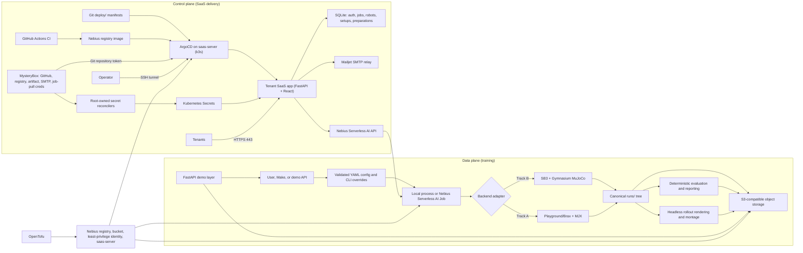

# Sim2Policy architecture

Sim2Policy is a configuration-driven reinforcement-learning template that turns a local or Nebius
Serverless AI training job into durable checkpoints, evaluation metrics, reports, and rollout
media. Track B (Gymnasium MuJoCo + Stable-Baselines3) is the dependable baseline. Track A (MuJoCo
Playground/Brax PPO on MJX) is isolated behind its own dependency and container target so it cannot
break Track B.

Two planes sit on top of the same durable run tree. The **data plane** trains policies as ephemeral
Serverless AI Jobs and writes artifacts to S3. The **control plane** (added by `add-saas-server`) is
an always-on `saas-server` VM running a single-node k3s cluster and ArgoCD, which GitOps-deploys a
tenant-facing SaaS app whose image is built by GitHub Actions and pulled from the Nebius registry.
The training path is unchanged; the control plane is a new, isolated front door.

## Main boundaries

- `openspec/` is the planning source of truth: proposals explain intent, designs record decisions,
  specs define behavior, and task files track verified implementation.
- `sim2policy/src/sim2policy/` contains shared configuration, run lifecycle, storage, evaluation,
  rendering, telemetry, reporting, API, and backend-specific trainer adapters.
- `sim2policy/configs/` holds reproducible environment/run contracts and hosted-demo presets.
- `sim2policy/Dockerfile` has backend-isolated `sb3` and `mjx` runtime targets.
- `.github/workflows/training-runtime-images.yml` builds both targets on CPU runners, validates
  backend-specific imports, publishes target-qualified immutable tags (`sb3-<sha>` / `mjx-<sha>`),
  and only then advances the `sb3-runtime` / `mjx-runtime` compatibility tags.
- `sim2policy/jobs/submit.sh` is the validated Nebius job boundary; it constructs argument arrays,
  enforces a timeout, and accepts MysteryBox secret selectors without printing their values.
- `sim2policy/infra/nebius/` uses OpenTofu to provision the container registry, bounded/versioned
  artifact bucket, and least-privilege artifact service account. Serverless jobs remain explicit
  submissions, not persistent infrastructure resources. `saas.tf` adds the always-on `saas-server`
  VM, dedicated orchestration identity, scoped MysteryBox secrets/read permits, and a
  `nebius_vpc_v1_security_group` that admits only 22/443/80;
  `cloud-init/saas-server.yaml.tftpl` bootstraps k3s, ArgoCD, and root-owned Secret reconcilers.
- `saas/` is the tenant-facing SaaS application: a FastAPI backend (`saas/backend/`) exposing the
  authenticated job API and validation-only robot/setup APIs with verified-email tenant scoping,
  SQLite persistence, and pluggable mock or Nebius orchestration, plus a React + Vite + TypeScript
  frontend (`saas/frontend/`). Original primitive MJCF examples live under `saas/samples/robots/`.
  One multi-stage image serves API, samples, and UI.
- The production catalog is derived from seven revision-gated executable job specifications:
  Go1 and G1 use MJX/JAX PPO on server-selected accelerators, while Ant, HalfCheetah, Hopper,
  Walker2D, and Reacher use CPU-vectorized SB3 PPO. Go1 Quick is the recommended card workload;
  Standard and Quality remain bounded secondary sizes. Users select a stable example identity and
  optional seed, never a backend, image, command, or hardware shape. Remote success enters durable
  finalization and `completed` is
  artifact-gated; validated artifacts use tenant-authorized opaque routes and short-lived storage
  redirects for HTML5 MP4 playback without making the bucket public.
- `deploy/` holds the GitOps state ArgoCD reconciles: `deploy/argocd/` (app-of-apps `Application`s)
  and `deploy/manifests/saas/` (Deployment, SQLite PVC, Service, Traefik Ingress, and immutable
  kustomize image mapping).
- `.github/workflows/saas-image.yml` builds the SaaS image and pushes it to the Nebius registry,
  authenticating with a `registry.pusher` service-account credential via `docker login --password-stdin`.
  During the temporary debug-deployment workflow, a successful `debug-portal` build commits the
  immutable image tag to that branch's kustomization after verifying that the branch has not
  advanced, so ArgoCD deploys the exact build without an operator override.
- `runs/<run-id>/` is canonical while a process runs. `checkpoints/`, `tensorboard/`, `videos/`, and
  `report/` map to the same subpaths at `s3://<bucket>/sim2policy/<run-id>/`, which is canonical
  across ephemeral jobs. A checkpoint is uploaded fully before `latest.json` is advanced.
- `sim2policy/web/` and the FastAPI package provide the thin demo surface. Run status and artifact
  manifests live in the same durable run tree, keeping API instances stateless.

## SaaS control plane

The control plane keeps a durable front door running without hand-run `make` commands. A single
`saas-server` CPU VM self-bootstraps a one-node **k3s** cluster and **ArgoCD** through cloud-init.
**Git is the source of truth**: ArgoCD syncs `deploy/` and self-heals drift, so a merge is the only
action needed to change what runs. The SaaS app image is built by **GitHub Actions**, pushed with an
immutable commit tag, committed back to the GitOps kustomization, and pulled from the Nebius
registry. ArgoCD reads the private manifests repo
using a **GitHub token sourced from MysteryBox** at boot; registry, artifact, and SMTP credentials
also originate in versioned MysteryBox payloads. Root-owned services use the VM identity to
reconcile allowlisted values into dedicated Kubernetes Secrets without placing credential values
in Git, OpenTofu state, images, command output, or application logs.

Network posture is deliberately narrow. The Nebius security group admits only inbound **SSH (22)**,
**HTTPS (443)**, and **HTTP (80)** for ACME/redirect; a host `ufw` firewall is defense-in-depth. The
k3s API (6443) and the ArgoCD UI are **not** public — operators manage the cluster over an **SSH
tunnel** (`ssh -L`). Only the tenant SaaS app is exposed, on 443 via Traefik. The app itself is
tenant-scoped: passwordless email verification issues opaque bearer sessions, and every job and
artifact derives its tenant from the verified email rather than a caller-controlled header. Users,
sessions, jobs, artifact manifests, bounded immutable robot XML/metadata, and normalized setup
drafts persist in SQLite on the single-writer `saas-data` PVC so a valid token and tenant state
survive restart; pending one-time codes and rate-limit windows stay in process memory (short-lived
by design, safe to lose on restart). Training artifacts remain durable in S3. The active
orchestration adapter submits
bounded allowlisted jobs through the Nebius SDK using the VM-managed renewable identity token.
The server-side catalog selects the runtime and compute shape per job spec: the five classic
MuJoCo examples use the isolated SB3 image on an allowlisted `cpu-d3` shape, Go1 uses the isolated
MJX image on a single H100, and G1 uses the smallest accelerator profile that passes the recorded
L40S-versus-H100 acceptance gates. Every accepted gallery result includes metrics, rollout video,
native checkpoint, resolved configuration, versions, and a deterministic checksummed policy bundle.

### Bring Your Robot validation boundary

The robot-onboarding path is deliberately inside the existing SaaS control plane and outside the
training data plane. One authenticated tenant may store up to 20 active immutable MJCF versions in
the existing SQLite/PVC database. Each upload is limited to 1 MiB UTF-8 XML, primitive geometry,
one floating root, 64 bodies, 64 joints, 64 actuators, 128 geoms, and depth 16; DTD/entities,
archives, includes, plugins, meshes, textures, height fields, external references, paths, and
unknown/executable elements are rejected before persistence. The original quadruped and biped
samples are packaged into the SaaS image and pass the same validator without an exception path.

A robot model supplies morphology, not a complete RL contract. The builder therefore combines one
owned validated robot with a server-owned task (`stand-balance`, `walk-forward`, or quadruped-only
`recover-from-fall`) and a server-owned scene preset (`flat-arena`, `ramp-course`,
`hurdle-course`, or `step-course`). Optional scene edits are restricted to at most six total
bounded `box`, `ramp`, `hurdle`, and `step` objects inside the published arena. There is no object
file, mesh, scene package, URL, reward, environment code, container, or plugin upload surface. A
tenant may keep 50 active immutable normalized setup drafts; robot/setup deletion is soft and all
access derives ownership from the bearer session.

Robot upload remains structural validation only. For custom training V1, a saved setup is eligible
only for biped/quadruped × Stand Balance/Walk Forward × Flat Arena/Ramp Course with no tenant-added
objects. Its derived `training_readiness` moves through `not_prepared`, `preparing`, `ready`, or
`preparation_failed`; wider saved setups remain `ineligible` with a stable reason. Preparation is a
bounded asynchronous `cpu-d3` job that verifies exact S3 input digests, reparses the stricter
training allowlist, composes a server-owned world, compiles MuJoCo, checks deterministic resets and
rollouts, renders headlessly, runs the Gymnasium/SB3 checker, and performs a short PPO
save/reload/inference cycle. Acceptance is fingerprinted to the robot/setup digests, immutable
runtime image, adapter/reward versions, and preparation profile.

Only the latest accepted current fingerprint enables the setup-bound Start training action. It
creates a normal `job_kind=custom-robot` Job using the immutable generic SB3 image and fixed
`custom-ppo-quick` `cpu-d3` profile. The tenant cannot select an image, command, object key,
hardware, secret, code, reward, or hyperparameter; uploaded MJCF is inert runtime input and no
per-robot image is built. Results use the normal artifact lifecycle and add the exact XML/setup,
resolved schemas/configuration, evaluation, rollout MP4, checkpoint, and checksummed simulator-only
policy bundle. Source deletion blocks new starts while retained preparation/job history and owned
artifacts remain readable. Custom resources never enter the public `/training-options` gallery or
generic `POST /jobs`, and V1 does not offer MJX/GPU selection.

The frozen V1 preparation profile is `cpu-d3` / `4vcpu-16gb`, 50 GiB, with a ten-minute cap; the
eight canonical combinations measured about 3m42s–3m57s create-to-finish. The fixed
`custom-ppo-quick` profile (contract version `custom-ppo-quick-v2`) is `cpu-d3` /
`16vcpu-64gb`, 100 GiB, sixteen subprocess vector environments, 3M steps, and a three-hour cap.
Observations and rewards are normalised, and the checkpoint published as the final policy is the
best-scoring one across the periodic evaluations rather than the last. The v1 shape — eight
serial environments and 100k steps — reliably produced 100% fall rates even for the bundled
sample robots on flat ground, so v2 spends real compute to make the attempt a convergence
attempt. Evaluation still records task success or below-threshold completion honestly; a good
result is not promised, only genuinely attempted.

### Secrets in use

All credentials originate in versioned **MysteryBox** payloads and reach workloads either as
Kubernetes Secrets reconciled by root-owned units (using the VM identity) or as secret references
resolved by Nebius services at use time. Values never appear in Git, OpenTofu inputs, command
arguments, or logs; OpenTofu records only non-secret secret/version IDs.

| MysteryBox secret | Payload keys | Consumed by |
| --- | --- | --- |
| `sim2policy-saas-github-token` | GitHub token | ArgoCD repo access, fetched once at boot by cloud-init |
| `sim2policy-saas-registry-pull` | `token` | k3s `nebius-registry` dockerconfigjson imagePullSecret (username `iam`) for pulling the SaaS app image |
| artifact access-key secret (created by `nebius_iam_v2_access_key.artifacts`) | `secret` (paired with the non-secret `artifact_access_key_id`) | `saas-nebius` Kubernetes Secret (`AWS_SECRET_ACCESS_KEY` for the backend's S3 artifact reads) and injected into each training job as a MysteryBox env-secret |
| `sim2policy-saas-smtp` | seven `SAAS_SMTP_*` keys | `saas-smtp` Kubernetes Secret for Mailjet login-code delivery |
| `sim2policy-job-registry-creds` | `REGISTRY_USERNAME`, `REGISTRY_PASSWORD` | Serverless AI jobs API at image-pull time, referenced by version ID in each job's `registry_credentials` (the jobs API requires this exact key shape; the single-key `token` pull secret is not accepted there) |

Kubernetes Secrets on the cluster: `saas-nebius` (the orchestration env contract — `NEBIUS_*`,
`AWS_*`, `SIM2POLICY_*`, including selector/version references, reconciled by
`saas-nebius-sync.service`), `saas-smtp` (reconciled from one pinned version by
`saas-smtp-sync.service`), and the `nebius-registry` imagePullSecret. The orchestrator itself holds
no long-lived key: the Nebius SDK authenticates with the **VM-managed renewable IAM token** mounted
read-only into the pod. Payload-viewer permits are scoped per secret to the `saas-server-access`
group; rotation means adding a new MysteryBox version, updating only the pinned version ID, and
rerunning the corresponding sync unit.

### Email authentication and delivery

The browser calls `POST /auth/request-code`; only the backend generates the six-digit code. The
backend stores a hash with a ten-minute expiry, then sends the plaintext code through authenticated
Mailjet SMTP over STARTTLS. The production Deployment explicitly selects `smtp` and requires the
non-optional `saas-smtp` Kubernetes Secret. That Secret is reconciled from one pinned MysteryBox
version containing exactly seven allowlisted `SAAS_SMTP_*` keys. Local and test processes may
select `mock`, but the production manifest and CI assertion reject mock delivery.

Provider acceptance is part of request success. Connection, timeout, TLS, authentication,
recipient, quota, or provider rejection failures delete the unusable pending code and return a
sanitized retryable `503`; abuse rate limiting still counts the request. Real-delivery logs contain
only result category and latency, never the recipient, code, SMTP response, API Key, or Secret Key.
The sender domain is authenticated with SPF, DKIM, and DMARC, while inbox placement and delivery
events remain the responsibility of Mailjet and recipient mail systems.

### Control-plane durability and rebuildability

Git remains canonical for manifests and immutable image selection, MysteryBox for credentials, S3
for training artifacts, and SQLite/PVC storage for transactional SaaS state. The PVC is node-local
and single-writer, matching the one-replica deployment; it improves rollout/restart durability but
is not a cross-node database or independent backup. Rebuilding the VM therefore also requires a
planned SQLite backup/restore or migration if that state must survive loss of the node/disk.

## Execution and safety model

Training, evaluation, rendering, and reporting are separate commands sharing one run identity.
Rendering tries EGL and retries once with OSMesa in a fresh process. Cloud acceptance proceeds from
cheap gates to expensive ones: image health/render smoke, bounded training plus storage sync,
interruption/resume, then full training and publication. Credentials stay in local configuration or
Nebius MysteryBox; generated artifacts and infrastructure state never belong in Git.

MJX training logs JAX backend/device discovery and explicit setup, initial-checkpoint,
compile/train, checkpoint-publication, and artifact-sync phases. A two-second `nvidia-smi` sampler
spans those phases and writes schema-v2 runtime telemetry with sample counts, mean/max utilization,
peak memory, and phase durations; start/end snapshots remain for compatibility but are not treated
as whole-run utilization.

Container images are built on CPU-only builders and consumed by separate ephemeral AI Jobs. This
keeps Docker compilation and registry upload off costly accelerator time. The SB3 examples are
CPU-vectorized and run on an allowlisted `cpu-d3` shape, which is both cheaper and faster for them
than an accelerator; only the MJX workloads take a GPU, and the flagship uses H100. The full Track
A flow uses `Go1JoystickFlatTerrain`, Brax PPO on MJX, immutable image digests, periodic S3
checkpoints, and a finalizer that downloads the durable run, restores progression checkpoints,
renders media, evaluates the final policy, writes reports/comparison data, and republishes the
completed manifest. See `sim2policy/docs/submission-checklist.md` for the verified run and artifact
references.

## Curated showcase campaigns

The public gallery is served from curated runs, and a campaign is what produces one. The controller
(`sim2policy/src/sim2policy/showcase_campaign.py`) owns plan, submit, watch, verify, select, extend,
accept, cleanup, and audit; the operator invokes documented commands and never infers a decision
from live logs. Exit codes are stable: 0 completed the requested transition, 10 remote work is still
active, 20 deterministic rejection, 30 a human decision is required, 40 an invariant or cleanup
failure. Exit 30 and 40 are full stops.

**The matrix is the contract.** `configs/showcase_training_matrix.yaml` declares seeds, step budgets,
checkpoint cadence, hardware, timeouts, and acceptance thresholds. Its normalized digest is recorded
in every plan and re-checked at verification, so an experiment cannot drift mid-campaign. Changing
the matrix means a new campaign, not an edited one.

**Per-attempt state** is `PLANNED`, `PREFLIGHTED`, `SUBMITTED`, `RUNNING`, `FINALIZING`, `VERIFIED`,
`ACCEPTED`, `REJECTED`, `NEEDS_HUMAN`, `CLEANED`, persisted under a gitignored
`.showcase-campaigns/<campaign-id>/` with atomic writes, an append-only journal, and an exclusive
lock that fails rather than queues. `NEEDS_HUMAN` is a stop, not a grave: it may reach `VERIFIED`
again, but only through a fresh verification proving complete durable evidence against a
terminal-completed provider state.

**Selection and extension.** All three base seeds run before selection, which ranks checkpoints on
the declared selection seeds — never on the final-acceptance seeds, and never on training reward
alone. If the leader meets the preferred target the extension is skipped; otherwise that seed alone
continues from its exact selected checkpoint, exactly once. A result that clears the hard floor but
misses the preferred target after its extension becomes `NEEDS_HUMAN` rather than being pinned
automatically.

**Parallel campaigns.** A campaign is serialized internally — one active remote job — but several may
run side by side on separate provider machines. Each declares the others through
`SIM2POLICY_PARALLEL_CAMPAIGN_IDS`, and jobs named for a declared sibling are accounted for rather
than treated as stray. Without this the cloud audit, which runs after every terminal attempt, would
see a sibling's job as an unaccounted resource and stop both campaigns. Two guarantees survive the
change: an undeclared active job still stops the campaign, and `audit-cloud` still refuses to report
clean while the campaign's own job is running. Seeds of one example cannot be split across
campaigns, because selection ranks candidates within a single campaign.

**The G1 recovery** aligns training with the public Walk Forward task through server-owned
`G1ForwardFlatTerrain` and `G1ForwardRoughTerrain` identities. They wrap pinned Playground v0.2.0
without changing physics, reset/noise, observations/actions, rewards, termination rules, domain
randomization, or PPO defaults; only the command source is invariant `[1, 0, 0]`, and pushes are
disabled. Exact termination telemetry distinguishes torso inversion, foot-foot contact,
foot-shin contact, NaN state, and an unknown upstream `done`, retaining simultaneous causes while
treating every non-horizon result as a hard failure.

The original G1 recovery gated full spend behind an evaluation-only sweep and a 46,202,880-step
rough pilot. The sweep reached its 90-minute provider timeout without a durable report, so it cannot
prove a parent and its dependent pilot is superseded rather than fabricated. The reviewed emergency
path permits exactly one fresh plan only under `user_reviewed_direct_full_v1`, bound to campaign
`gallery-g1-direct-full-20260803-01`, seed 0, one job, immutable revision/image/matrix evidence, the
fixed H100 shape, 100 GiB disk, five-hour timeout, and zero retries/extensions/overrides. Any drift
fails before submission. The fresh result trains flat once, uninterrupted, to the derived
149,422,080-step PPO boundary and evaluates only that final checkpoint. A pass atomically creates an
immutable transition record binding the exact parent object/path, sidecar step and hashes,
source/target environments, image/config/matrix digests,
measured spend, rough budget, and trainer load path. Before rough updates, Brax restores only its
supported observation-normalizer/policy/value tuple; optimizer, learner step, rollout state, and
PRNG state are explicitly fresh at seed 0. Finalization-only recovery must consume this record and
the recorded exact rough selection, never re-evaluate the flat gate or reconstruct lineage.

The plan declares exact `-rough` and `-flat` phase evidence prefixes. Flat and rough requests are
aligned down to whole PPO epoch quanta so Brax's batch rounding cannot overshoot the fixed 450M
ceiling. A crash writes sanitized durable failure evidence because provider container logs are not
readable. Finalized `REJECTED` and `NEEDS_HUMAN` policies are successful workload completions; only
the cloud campaign controller maps those business outcomes to exit 20/30.

**The durable destination travels as a unit.** A campaign job's bucket, endpoint, region, *and*
`storage.mode` are set together on every command path — SB3, MJX, and curriculum — and asserted per
path rather than for one representative example. The configs declare `mode: local`, and an
`ArtifactStore` is inert unless the mode is `s3`, so a path that forwards the destination without the
mode trains for its full budget and durably writes nothing. Nothing downstream can detect this except
verification, which sees only an unreadable manifest.

**Publication.** `catalog.SHOWCASE_RUNS` pins each example to one curated run and is the showcase
resolver's only source of run identity. Accepted examples publish independently, so an example that
is still training or awaiting a human decision stays a placeholder while the rest ship. A promotion
runs the full gate suite on Nebius compute — lint, types, runtime and backend suites, frontend tests
and production build, plus a tracked-file secret and large-file scan — and deployment is verified
through the workflow, the GitOps tag bump, the ArgoCD sync, the rolled pod, and the public endpoint
rather than inferred from a push.

**Recorded outcome.** Six of the seven examples — Reacher, Hopper, Go1, HalfCheetah, Ant, and
Walker2D — are pinned and serving publicly, each having cleared its hard floor *and* its preferred
target with no extension consumed and no retry. Three of them reached that on a retune rather than
more steps: measured evidence showed Ant and Walker2D already beating their reward targets and
failing only on episode length, with their single extensions unable to beat their own base
checkpoints, which identifies a plateau rather than undertraining. A wider rollout, larger batch, and
larger policy/value heads cleared all three preferred targets at unchanged step budgets, so they
publish on merit instead of as hard-floor overrides.

G1 is the open example. The prior joystick-command curriculum completed in 244 minutes but its exact
selected rough checkpoint achieved 0/20 no-termination episodes despite 0.862 m/s mean velocity.
It remains an unpublished diagnostic baseline. The fixed-forward recovery above is a new causal
experiment: no reward, PPO, seed, hardware, threshold, or total-step increase is authorized. The
failed sweep and unrun pilot remain historical evidence; only the exact reviewed direct-full campaign
may proceed.
