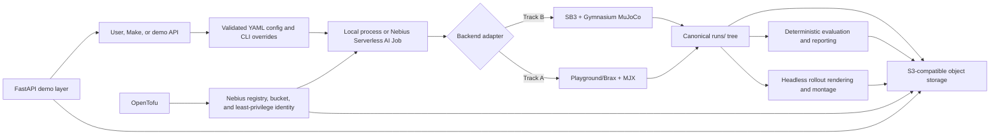

# Sim2Policy architecture

Sim2Policy is a configuration-driven reinforcement-learning template that turns a local or Nebius
Serverless AI training job into durable checkpoints, evaluation metrics, reports, and rollout
media. Track B (Gymnasium MuJoCo + Stable-Baselines3) is the dependable baseline. Track A (MuJoCo
Playground/Brax PPO on MJX) is isolated behind its own dependency and container target so it cannot
break Track B.

## Main boundaries

- `openspec/` is the planning source of truth: proposals explain intent, designs record decisions,
  specs define behavior, and task files track verified implementation.
- `sim2policy/src/sim2policy/` contains shared configuration, run lifecycle, storage, evaluation,
  rendering, telemetry, reporting, API, and backend-specific trainer adapters.
- `sim2policy/configs/` holds reproducible environment/run contracts and hosted-demo presets.
- `sim2policy/Dockerfile` has backend-isolated `sb3` and `mjx` runtime targets.
- `sim2policy/jobs/submit.sh` is the validated Nebius job boundary; it constructs argument arrays,
  enforces a timeout, and accepts MysteryBox secret selectors without printing their values.
- `sim2policy/infra/nebius/` uses OpenTofu to provision the container registry, bounded/versioned
  artifact bucket, and least-privilege artifact service account. Serverless jobs remain explicit
  submissions, not persistent infrastructure resources.
- `runs/<run-id>/` is canonical while a process runs. `checkpoints/`, `tensorboard/`, `videos/`, and
  `report/` map to the same subpaths at `s3://<bucket>/sim2policy/<run-id>/`, which is canonical
  across ephemeral jobs. A checkpoint is uploaded fully before `latest.json` is advanced.
- `sim2policy/web/` and the FastAPI package provide the thin demo surface. Run status and artifact
  manifests live in the same durable run tree, keeping API instances stateless.

## Execution and safety model

Training, evaluation, rendering, and reporting are separate commands sharing one run identity.
Rendering tries EGL and retries once with OSMesa in a fresh process. Cloud acceptance proceeds from
cheap gates to expensive ones: image health/render smoke, bounded training plus storage sync,
interruption/resume, then full training and publication. Credentials stay in local configuration or
Nebius MysteryBox; generated artifacts and infrastructure state never belong in Git.
