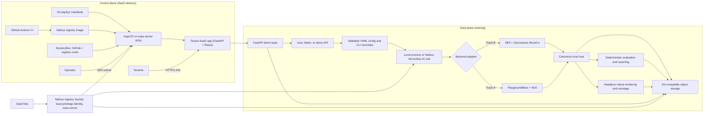

# Sim2Policy architecture

Sim2Policy is a configuration-driven reinforcement-learning template that turns a local or Nebius
Serverless AI training job into durable checkpoints, evaluation metrics, reports, and rollout
media. Track B (Gymnasium MuJoCo + Stable-Baselines3) is the dependable baseline. Track A (MuJoCo
Playground/Brax PPO on MJX) is isolated behind its own dependency and container target so it cannot
break Track B.

Two planes sit on top of the same durable run tree. The **data plane** trains policies as ephemeral
Serverless AI Jobs and writes artifacts to S3. The **control plane** (added by `add-saas-server`) is
an always-on `saas-server` VM running a single-node k3s cluster and ArgoCD, which GitOps-deploys a
tenant-facing SaaS app whose image is built by GitHub Actions and pulled from the Nebius registry.
The training path is unchanged; the control plane is a new, isolated front door.

## Main boundaries

- `openspec/` is the planning source of truth: proposals explain intent, designs record decisions,
  specs define behavior, and task files track verified implementation.
- `sim2policy/src/sim2policy/` contains shared configuration, run lifecycle, storage, evaluation,
  rendering, telemetry, reporting, API, and backend-specific trainer adapters.
- `sim2policy/configs/` holds reproducible environment/run contracts and hosted-demo presets.
- `sim2policy/Dockerfile` has backend-isolated `sb3` and `mjx` runtime targets.
- `sim2policy/jobs/submit.sh` is the validated Nebius job boundary; it constructs argument arrays,
  enforces a timeout, and accepts MysteryBox secret selectors without printing their values.
- `sim2policy/infra/nebius/` uses OpenTofu to provision the container registry, bounded/versioned
  artifact bucket, and least-privilege artifact service account. Serverless jobs remain explicit
  submissions, not persistent infrastructure resources. `saas.tf` adds the always-on `saas-server`
  VM, its dedicated service account, a MysteryBox GitHub-token secret, and a `nebius_vpc_v1_security_group`
  that admits only 22/443/80; `cloud-init/saas-server.yaml.tftpl` bootstraps k3s + ArgoCD.
- `saas/` is the tenant-facing SaaS application: a FastAPI backend (`saas/backend/`) exposing the
  job API with tenant scoping and a pluggable orchestration backend (`mock` today), plus a React +
  Vite + TypeScript frontend (`saas/frontend/`). One multi-stage image serves API and UI.
- `deploy/` holds the GitOps state ArgoCD reconciles: `deploy/argocd/` (app-of-apps `Application`s)
  and `deploy/manifests/saas/` (Deployment, Service, Traefik Ingress, kustomize image mapping).
- `.github/workflows/saas-image.yml` builds the SaaS image and pushes it to the Nebius registry,
  authenticating with a `registry.pusher` service-account credential via `docker login --password-stdin`.
- `runs/<run-id>/` is canonical while a process runs. `checkpoints/`, `tensorboard/`, `videos/`, and
  `report/` map to the same subpaths at `s3://<bucket>/sim2policy/<run-id>/`, which is canonical
  across ephemeral jobs. A checkpoint is uploaded fully before `latest.json` is advanced.
- `sim2policy/web/` and the FastAPI package provide the thin demo surface. Run status and artifact
  manifests live in the same durable run tree, keeping API instances stateless.

## SaaS control plane

The control plane keeps a durable front door running without hand-run `make` commands. A single
`saas-server` CPU VM self-bootstraps a one-node **k3s** cluster and **ArgoCD** through cloud-init.
**Git is the source of truth**: ArgoCD syncs `deploy/` and self-heals drift, so a merge is the only
action needed to change what runs. The SaaS app image is built by **GitHub Actions** and pulled from
the Nebius registry — by the VM service account's `registry.puller` identity when possible, with a
MysteryBox `imagePullSecret` as the documented fallback. ArgoCD reads the private manifests repo
using a **GitHub token sourced from MysteryBox** at boot; no credential value lives in Git.

Network posture is deliberately narrow. The Nebius security group admits only inbound **SSH (22)**,
**HTTPS (443)**, and **HTTP (80)** for ACME/redirect; a host `ufw` firewall is defense-in-depth. The
k3s API (6443) and the ArgoCD UI are **not** public — operators manage the cluster over an **SSH
tunnel** (`ssh -L`). Only the tenant SaaS app is exposed, on 443 via Traefik. The app itself is
stateless and tenant-scoped: every job and artifact belongs to the `X-Tenant-Id` that created it,
and orchestration sits behind an interface so a real Nebius Serverless backend can replace the
`mock` without changing the tenant-facing API. All durable state lives in Git (manifests) and S3
(artifacts), so the VM is disposable and rebuildable from OpenTofu + GitOps.

## Execution and safety model

Training, evaluation, rendering, and reporting are separate commands sharing one run identity.
Rendering tries EGL and retries once with OSMesa in a fresh process. Cloud acceptance proceeds from
cheap gates to expensive ones: image health/render smoke, bounded training plus storage sync,
interruption/resume, then full training and publication. Credentials stay in local configuration or
Nebius MysteryBox; generated artifacts and infrastructure state never belong in Git.

Container images are built on a disposable CPU VM and consumed by separate disposable H100 AI
Jobs. This keeps Docker compilation and registry upload off costly accelerator time. The full Track
A flow uses `Go1JoystickFlatTerrain`, Brax PPO on MJX, immutable image digests, periodic S3
checkpoints, and a finalizer that downloads the durable run, restores progression checkpoints,
renders media, evaluates the final policy, writes reports/comparison data, and republishes the
completed manifest. See `sim2policy/docs/submission-checklist.md` for the verified run and artifact
references.
