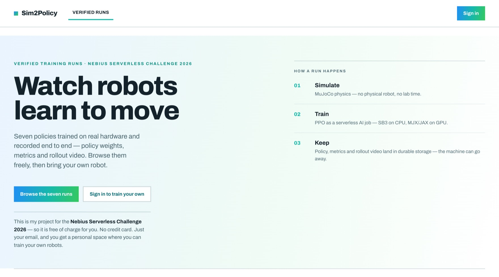
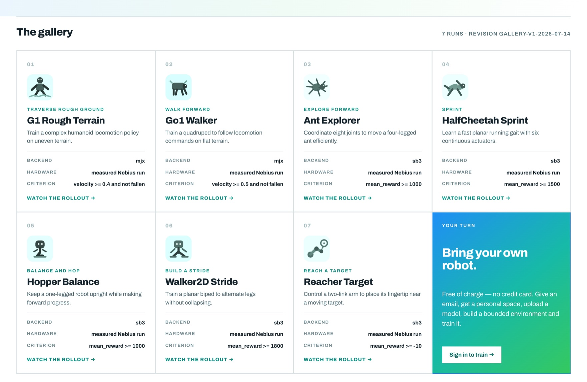
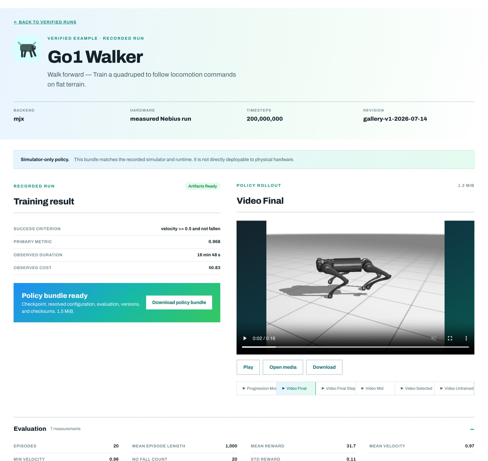
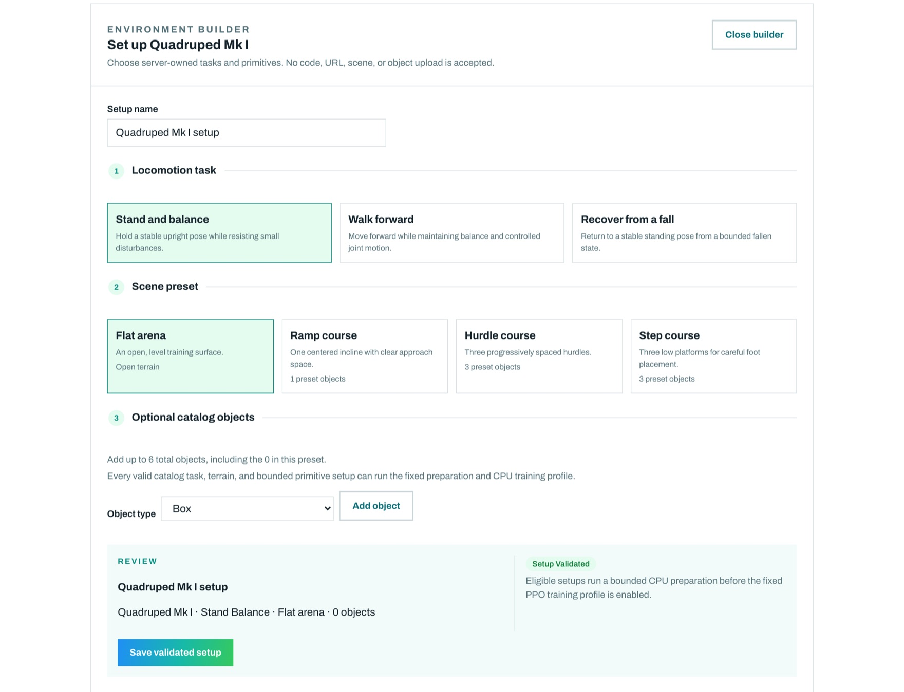
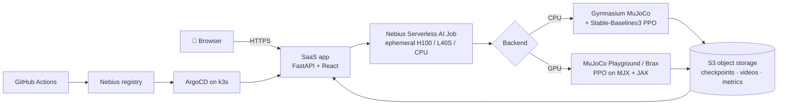

<div align="center">

# 🤖 Sim2Policy

### Train a robot to walk — from your browser, on serverless GPUs, for pocket change.

[](https://sim-policy-trainer-challenge.info)

[](https://nebius.com)
[](LICENSE)
[](sim2policy/pyproject.toml)
[](https://mujoco.org)
[-8a2be2)](sim2policy/README.md)



</div>

---

## Why it exists

Serverless GPUs are easy to start and easy to lose. A job spins up, trains, disappears — and takes
the evidence with it. **Sim2Policy makes every run outlive its machine.**

Each training job leaves behind a durable, reproducible result in object storage:

🧠 **A trained checkpoint** · 🎬 **Rollout video** (wobbling → walking) · 📊 **Deterministic
evaluation** · 📦 **A policy bundle** with config, versions, and checksums

## Seven policies. $3.84.

Every number below is read live from the deployed gallery — observed on the job itself, not estimated.

| Run | Backend | Steps | Duration | Cost | Result |
| --- | --- | --: | --: | --: | --- |
| **Go1 Walker** | MJX · H100 | 200,000,000 | 16m 47s | **$0.83** | ✅ velocity 0.97 ≥ 0.5 |
| G1 Rough Terrain | MJX · H100 | 250,511,360 | 1h 45m | $2.73 | ✅ velocity 0.74 ≥ 0.4, 20/20 no falls |
| Walker2D Stride | SB3 · CPU | 5,000,000 | 29m 32s | $0.10 | ✅ reward 5,314 ≥ 1,800 |
| Hopper Balance | SB3 · CPU | 5,000,000 | 21m 00s | $0.07 | ✅ reward 3,632 ≥ 1,000 |
| Ant Explorer | SB3 · CPU | 3,000,000 | 21m 33s | $0.07 | ✅ reward 2,975 ≥ 1,000 |
| HalfCheetah Sprint | SB3 · CPU | 3,000,000 | 12m 41s | $0.04 | ✅ reward 3,332 ≥ 1,500 |
| Reacher Target | SB3 · CPU | 1,000,000 | 2m 52s | **$0.01** | ✅ reward −5.6 ≥ −10 |

Real GPU reinforcement learning at coffee-money prices, and every run now clears its own bar.

G1's row is the rough-terrain phase, which is what the gallery publishes. It is the second half of a
two-phase curriculum: a flat phase trains 199,229,440 steps first and must pass a 9-of-10 survival
gate before rough training is funded at all. Counting both phases, the full job was 450M steps in
4h 07m. The gate is there so a bad hypothesis costs one flat hour instead of a full run — and it
did exactly that once (see below).

## Pick an example, press go

Seven curated robots, from a two-link `Reacher` on CPU to the **Go1 quadruped** and **G1 humanoid**
on an H100. Anonymous visitors browse the whole gallery — real videos, real numbers, no account.



## Every run ends in evidence

Success criterion, primary metric, observed duration and cost, the rollout video, the full
evaluation, and a one-click policy bundle — all bound to the exact acceptance revision.



### The G1 humanoid, and what the gates were for

The hardest run in the gallery was also the one that stayed red the longest, and the honest version
of that story is worth more than the green checkmark:

- **It was published failing.** For a while the G1 card read *"published as a recording, criterion
  not met."* Leaving it visible cost nothing and kept the gallery's claim true.
- **Two of the failures were never the policy's fault.** Its rough scene was a 20 m × 20 m height
  field, but a 1,000-step horizon at the commanded velocity needs 16 m from a random spawn — the
  robot ran out of world before it ran out of horizon. And the gates demanded 10 perfect episodes to
  proceed and 20 more to publish, from a policy that survived ~80% of them — 10.7% and 1.2%, so
  about 0.1% of clearing both. More training could not have fixed either. The scene became a
  server-owned 60 m one; the gates became 9-of-10 and 18-of-20.
- **The real bug was one reward scale.** Pinned G1 pays nothing for staying upright and applies a
  one-off `termination = -100`. Turning on `alive = 0.25` alone made it walk faster (0.91 m/s) but
  survival stayed at exactly 8/10. Setting `termination = 0.0` as well — completing the shape that
  T1, the other humanoid in the same pinned package, already ships — took the flat gate from 8/10 to
  **10/10** and rough acceptance to **20/20 full horizons, zero falls**. The penalty was not merely
  useless; at a ~2 s discount horizon it was noise the critic could not attribute, and it interfered
  with the dense survival signal instead of helping.

The diagnostic run that isolated the first half stopped at the flat gate after 54 minutes and never
funded rough training. That is the gate working: **$1.39 to reject a hypothesis instead of $6.37.**

## Bring your own robot

Sign in with an email code, upload a bounded MJCF model, then compose a setup from **server-owned**
tasks and scenes. A bounded CPU job verifies the robot actually compiles, renders, and trains before
the Start Training button unlocks.



> You get choices, not footguns: no uploaded reward code, no scene XML, no remote URLs — and the
> backend, image, GPU shape, and command stay locked server-side.

## How it works



One tiny always-on VM runs the app and launches disposable jobs; **all the heavy lifting is
serverless**. Checkpoints stream to S3 as training progresses, so an interrupted job resumes instead
of restarting. Infrastructure is OpenTofu, delivery is GitOps, and no secret ever touches Git.

**Stack:** MuJoCo · MJX/JAX · Stable-Baselines3 · Brax · FastAPI · React + Vite · SQLite ·
Docker · k3s · ArgoCD · OpenTofu · Nebius Serverless AI

## Run it locally

```bash
cd sim2policy && uv sync --extra dev --extra sb3
```

```bash
make smoke ENV=smoke_sb3 RUN_ID=dev
```

```bash
make train ENV=halfcheetah_sb3 RUN_ID=hc-01 && make report ENV=halfcheetah_sb3 RUN_ID=hc-01
```

Gates run in increasing cost order — local tests → image checks → render smoke → bounded job → full
run. `make cloud-dry-run` previews a Nebius submission with every secret redacted.

## What's inside

| Path | Contents |
| --- | --- |
| [`sim2policy/`](sim2policy/README.md) | Training template: two backends, evaluation, rendering, job submission, OpenTofu infra |
| [`saas/`](saas/README.md) | FastAPI + React app: public showcase, auth, custom-robot flow |
| [`deploy/`](deploy/README.md) | Kubernetes + ArgoCD state reconciled onto the cluster |
| [`openspec/specs/`](openspec/specs/) | Behavioural contract — one directory per capability |
| [`ARCHITECTURE.md`](ARCHITECTURE.md) | System boundaries, design decisions, and their rationale |

**Start with [ARCHITECTURE.md](ARCHITECTURE.md)** — it explains how the two planes fit together, why
each boundary sits where it does, and points at the detailed document for every area.

---

<div align="center">

Built for the **Nebius Serverless Challenge 2026** · MIT licensed · `#NebiusServerlessChallenge`

**[Try it live (till the End of August 2026) →](https://sim-policy-trainer-challenge.info)**

</div>
