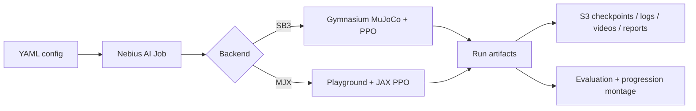

# Sim2Policy

Train a locomotion policy in a Nebius Serverless AI Job, persist every useful artifact to
S3-compatible storage, and render the visible progression from flailing to walking.

## The idea in ten lines

An environment returns an observation. A policy chooses an action. MuJoCo advances the robot and
returns a reward. PPO repeatedly collects those transitions and updates the policy. Sim2Policy has
two backends: Stable-Baselines3 is the dependable CPU-simulation baseline; MuJoCo Playground uses
MJX/JAX for thousands of GPU-parallel simulations. A run is configuration plus a stable run ID.
The container is disposable; `s3://<bucket>/sim2policy/<run-id>/` is not. Initial, periodic, and
final checkpoints make both resumption and progression videos possible.



## Quickstart

Use Linux with Python 3.11/3.12. A GPU is optional for shared tests and required for the intended
cloud workflows.

```bash
cd sim2policy
uv sync --extra dev
make check test
uv run sim2policy validate-config configs/smoke_sb3.yaml
```

On the Linux/NVIDIA development VM:

```bash
uv sync --extra dev --extra sb3
uv run python -m sim2policy.health --backend sb3
make train ENV=smoke_sb3 RUN_ID=smoke
make render ENV=smoke_sb3 RUN_ID=smoke CHECKPOINT=runs/smoke/checkpoints/final-000000000256.zip
make evaluate ENV=smoke_sb3 RUN_ID=smoke CHECKPOINT=runs/smoke/checkpoints/final-000000000256.zip
```

Build and preview a cloud job:

```bash
make build-sb3 IMAGE=<registry>/sim2policy:sb3
export PLATFORM=gpu-l40s-d PRESET=1gpu-16vcpu-200gb TIMEOUT=1h SUBNET_ID=<id>
make cloud-dry-run IMAGE=<registry>/sim2policy:sb3 ENV=halfcheetah_sb3 RUN_ID=hc-001
make cloud-train IMAGE=<registry>/sim2policy:sb3 ENV=halfcheetah_sb3 RUN_ID=hc-001
```

See [job operations](sim2policy/jobs/README.md) before the first submission.

## Run contract

Configs select backend/environment, seed, step budget, parallel environments, checkpoint cadence,
evaluation seeds, success criterion, media settings, storage, and explicit price inputs. CLI
overrides are validated before an environment is created. A run produces:

```text
runs/<run-id>/
├── metadata.json
├── checkpoints/
├── tensorboard/
├── videos/
└── report/{metrics.json,summary.md}
```

Set storage to `mode: s3` and provide bucket/endpoint/region settings. Credentials use boto3's
standard provider chain; jobs should inject MysteryBox secrets. Resume locally with `--resume` or
from the latest completed remote manifest with `--resume remote`. A checkpoint is uploaded before
the latest manifest changes, so a partial upload cannot become resumable.

## Add an environment

Copy the nearest config, change the environment and its recorded hyperparameters, and define an
honest success criterion. SB3 currently uses a mean reward threshold. MJX uses locomotion velocity
and non-fall conditions. Run config validation, short training, evaluation, and render smoke before
raising the budget.

## Phased delivery and spend control

Track B must pass end to end first. Attempt Track A only after checkpoint, storage, evaluation, and
rendering work. If the JAX/CUDA/Playground image does not pass its GPU smoke gate by the cutoff,
ship Track B rather than weakening it. Always run GPU visibility, image health, rendering, short
training/storage, and resume gates before a full run. Use explicit timeouts and cancel debug jobs.

## Troubleshooting

- EGL failure: rendering retries once in a fresh process with `MUJOCO_GL=osmesa`.
- JAX reports CPU: use the MJX Linux image, verify the NVIDIA driver, and run the health command.
- Registry pull failure: verify image reachability and `REGISTRY_SECRET`.
- No S3 output: check endpoint, bucket, credential selector, and the per-run prefix.
- Resume rejected: backend, environment, metadata, or checksum differs; start a new run ID.
- Quota/subnet errors: confirm tenant admin membership, GPU quota, region, and subnet ID.

## Demo

Show job submission, a rising reward curve, then initial / quarter / final rollouts. Report actual
runtime, hardware, utilization, dated hourly rate, and cost; unavailable values stay unavailable.
The planned judge narration and submission checklist live in the OpenSpec change.

