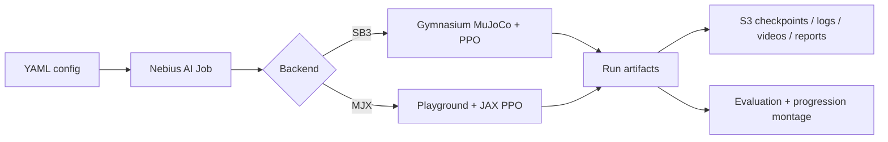

# Sim2Policy

Train a locomotion policy in a Nebius Serverless AI Job, persist every useful artifact to
S3-compatible storage, and render the visible progression from flailing to walking.

## The idea in ten lines

An environment returns an observation. A policy chooses an action. MuJoCo advances the robot and
returns a reward. PPO repeatedly collects those transitions and updates the policy. Sim2Policy has
two backends: Stable-Baselines3 is the dependable CPU-simulation baseline; MuJoCo Playground uses
MJX/JAX for thousands of GPU-parallel simulations. A run is configuration plus a stable run ID.
The container is disposable; `s3://<bucket>/sim2policy/<run-id>/` is not. Initial, periodic, and
final checkpoints make both resumption and progression videos possible.



## How this differs from the robotics fine-tuning recipes

Sim2Policy learns a policy by **reinforcement learning inside a physics simulator**: PPO collects
its own transitions from MuJoCo/MJX rollouts and improves from reward alone — no demonstration
dataset, no teleoperation, no labels. This is deliberately different from imitation-learning
recipes such as the LeRobot ACT/Diffusion and SmolVLA fine-tuning examples in the
[Nebius serverless-ai-cookbook](https://github.com/nebius/serverless-ai-cookbook), which
*supervise* a network on pre-recorded real-robot demonstrations. There is no overlap with the
cookbook on the pieces that define this project: RL with PPO, MuJoCo/MJX GPU-parallel simulation,
sim-to-real locomotion, and a **hosted training-as-a-service API** that exposes allowlisted presets
(with a credential-free mock backend) rather than clone-and-run scripts. If you have demonstration
data and want supervised fine-tuning, use the cookbook's LeRobot/SmolVLA jobs; if you want a policy
trained from simulation and reward, use Sim2Policy.

## Quickstart

Use Linux with Python 3.11/3.12. A GPU is optional for shared tests and required for the intended
cloud workflows.

```bash
cd sim2policy
uv sync --extra dev
make check test
uv run sim2policy validate-config configs/smoke_sb3.yaml
```

On the Linux/NVIDIA development VM:

```bash
uv sync --extra dev --extra sb3
uv run python -m sim2policy.health --backend sb3
make train ENV=smoke_sb3 RUN_ID=smoke
make render ENV=smoke_sb3 RUN_ID=smoke CHECKPOINT=runs/smoke/checkpoints/final-000000000256.zip
make evaluate ENV=smoke_sb3 RUN_ID=smoke CHECKPOINT=runs/smoke/checkpoints/final-000000000256.zip
```

Build and preview a cloud job:

```bash
cd sim2policy/infra/nebius
source ~/.config/sim2policy/tofu-backend.env
export NEBIUS_IAM_TOKEN="$(nebius iam get-access-token)"
tofu init -backend-config=backend.hcl && tofu apply
export IMAGE="$(tofu output -raw sb3_image)"
export S3_BUCKET="$(tofu output -raw artifact_bucket)"
export S3_ACCESS_KEY_ID="$(tofu output -raw artifact_access_key_id)"
export S3_SECRET="$(tofu output -raw artifact_secret_selector)"
export S3_ENDPOINT=https://storage.eu-north1.nebius.cloud S3_REGION=eu-north1
export PLATFORM=gpu-l40s-a PRESET=1gpu-8vcpu-32gb TIMEOUT=1h SUBNET_ID=<id>
cd ../..
make cloud-dry-run IMAGE="$IMAGE" ENV=halfcheetah_sb3 RUN_ID=hc-001
make cloud-train IMAGE="$IMAGE" ENV=halfcheetah_sb3 RUN_ID=hc-001
```

See [OpenTofu infrastructure](sim2policy/infra/nebius/README.md) and
[job operations](sim2policy/jobs/README.md) before the first submission.

## Two ways to use Sim2Policy

**1. Hosted demo API.** A thin HTTP service lets demo users start one of seven verified training
stories and fetch its artifacts without cloning the repo or owning Nebius infrastructure. Go1 and
G1 use MJX/JAX; Ant, HalfCheetah, Hopper, Walker2D, and Reacher use SB3. The server selects the
runtime and hardware, and users may change only catalog-declared bounded fields such as `seed` (or
a Go1 workload size). No custom code, images, commands, secrets, compute choice, or reward function
is accepted. The API validates the request, creates a run, and triggers a Nebius Serverless AI Job
(or a local mock). Each completed verified example exposes a rollout, metrics, checkpoint, resolved
configuration, and deterministic simulator-only policy bundle.

```bash
cd sim2policy
uv sync --extra dev --extra api
make api                      # serves on 127.0.0.1:8000 with the no-credentials mock backend
# in another shell:
curl localhost:8000/health
curl localhost:8000/training-options
curl -X POST localhost:8000/train -H 'content-type: application/json' \
  -d '{"preset":"ant-demo","seed":42}'
curl localhost:8000/runs/<run_id>
curl localhost:8000/runs/<run_id>/artifacts
```

The mock backend runs the full status lifecycle locally and writes placeholder artifacts, so the
entire API can be exercised with no Nebius credentials or GPU. Set `SIM2POLICY_API_BACKEND=nebius`
(plus `IMAGE`, `PLATFORM`, `PRESET`, `SUBNET_ID`, and `SIM2POLICY_API_SUBMIT_SCRIPT=jobs/submit.sh`)
to launch real jobs. See the [demo API reference](sim2policy/docs/api.md) for endpoints, request
shapes, presets, and security limits.

**2. Bring-your-own-Nebius template.** Clone the repo and run training in your own account with the
backend, environment, and budget you choose. This is the workflow in the Quickstart above and the
rest of this document.

## Run contract

Configs select backend/environment, seed, step budget, parallel environments, checkpoint cadence,
evaluation seeds, success criterion, media settings, storage, and explicit price inputs. CLI
overrides are validated before an environment is created. A run produces:

```text
runs/<run-id>/
├── metadata.json
├── checkpoints/
├── tensorboard/
├── videos/
└── report/{metrics.json,summary.md}
```

Set storage to `mode: s3` and provide bucket/endpoint/region settings. Credentials use boto3's
standard provider chain; jobs should inject MysteryBox secrets. Resume locally with `--resume` or
from the latest completed remote manifest with `--resume remote`. A checkpoint is uploaded before
the latest manifest changes, so a partial upload cannot become resumable.

## Add an environment

Copy the nearest config, change the environment and its recorded hyperparameters, and define an
honest success criterion. SB3 currently uses a mean reward threshold. MJX uses locomotion velocity
and non-fall conditions. Run config validation, short training, evaluation, and render smoke before
raising the budget.

## Phased delivery and spend control

Track B must pass end to end first. Attempt Track A only after checkpoint, storage, evaluation, and
rendering work. If the JAX/CUDA/Playground image does not pass its GPU smoke gate by the cutoff,
ship Track B rather than weakening it. Always run GPU visibility, image health, rendering, short
training/storage, and resume gates before a full run. Use explicit timeouts and cancel debug jobs.

## Troubleshooting

- EGL failure: rendering retries once in a fresh process with `MUJOCO_GL=osmesa`.
- JAX reports CPU: use the MJX Linux image, verify the NVIDIA driver, and run the health command.
- Registry pull failure: verify image reachability and `REGISTRY_SECRET`.
- No S3 output: check endpoint, bucket, credential selector, and the per-run prefix.
- Resume rejected: backend, environment, metadata, or checksum differs; start a new run ID.
- Quota/subnet errors: confirm tenant admin membership, GPU quota, region, and subnet ID.

## Demo

Show job submission, a rising reward curve, then initial / quarter / final rollouts. Report actual
runtime, hardware, utilization, dated hourly rate, and cost; unavailable values stay unavailable.
Use the rehearsed [demo script](sim2policy/docs/demo-script.md), lightweight
[sample assets](sim2policy/assets/samples/README.md), and the
[release audit](sim2policy/docs/release-audit.md) before submission. The completed
[submission checklist](sim2policy/docs/submission-checklist.md) records the verified Nebius jobs,
immutable image, measured results, and durable artifacts.
